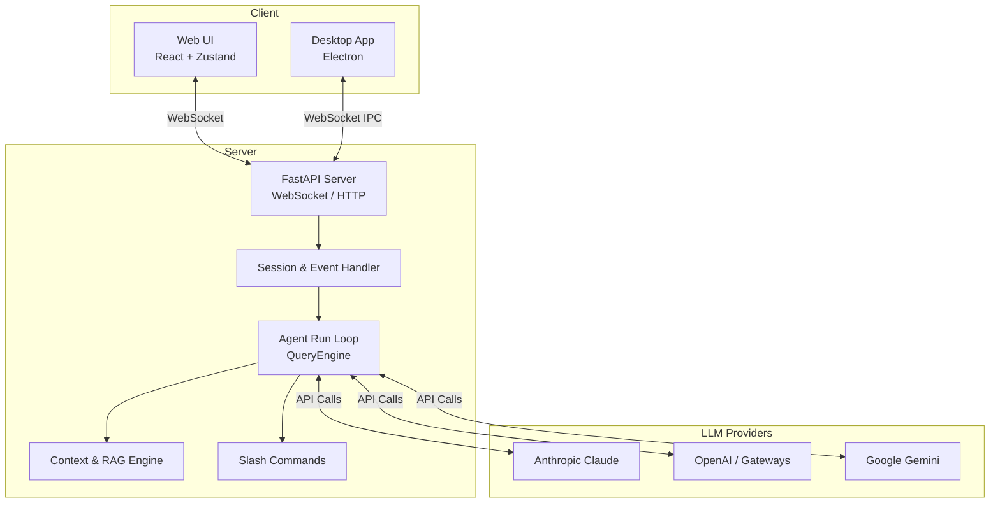

<div align="center">

# 🚀 MiniCode

**The Ultimate Open-Source AI Coding Agent Environment**<br>
**终极开源 AI 编程智能体环境**

[](https://opensource.org/licenses/MIT)
[](https://www.python.org/)
[](https://nodejs.org/)
[](https://electronjs.org/)
[](http://makeapullrequest.com)

[**🇺🇸 English**](#english) | [**🇨🇳 简体中文**](#中文)

</div>

---

<span id="english"></span>
# 🇺🇸 English Documentation

**MiniCode** is a powerful open-source AI coding assistant and agentic environment. Built around a `FastAPI + React + WebSocket` stack, it provides an AI engine that fully masters your local workspace. It runs as a lightweight Web UI or a deeply integrated native Electron Desktop application, seamlessly connecting with your local development workflow.

## ✨ Key Features

- 🤖 **Native Multi-Model Integration**: Full compatibility with LLMs like Anthropic Claude, OpenAI GPT, and Google Gemini, including native multimodal support for images and PDFs.
- 🔌 **Model Context Protocol (MCP)**: Complete MCP lifecycle support to infinitely expand the AI's capabilities, allowing seamless interaction with external APIs, tools, and databases.
- 🛡️ **Intelligent Permission Control**: Built-in granular **Approval Rules** ensure the AI agent operates securely and safely when modifying files or executing terminal commands.
- 💻 **Dual Runtime (Web & Desktop)**: Run as a local web service for lightweight access, or as a standalone Electron app with deep system integrations.
- ⚡ **RAG & Context-Aware Conversations**: Automatic local codebase indexing (Vector DB) fuels Retrieval-Augmented Generation (RAG). The AI instantly understands your exact workspace context.
- ⌨️ **Immersive Slash Commands**: Highly extensible built-in command system. Type `/plan`, `/review`, or `/debug` to instantly trigger specialized AI agent workflows.

## 🏗️ Architecture Overview

MiniCode relies on a high-performance WebSocket architecture to maintain persistent connections, ensuring ultra-smooth streaming and real-time tool execution feedback.



## 📂 Project Structure

A clean, modular design decouples the UI, backend logic, and desktop shell:

```text
MiniCode/
├── backend/            # Python FastAPI core
│   ├── agent/          # Agent loop, Context builder, QueryEngine
│   ├── commands/       # Slash commands & registry
│   ├── mcp/            # Model Context Protocol integration
│   ├── ws/             # WebSocket real-time snapshots
│   └── tools/          # Built-in OS & File tools
├── frontend/           # React + Zustand web application
│   ├── src.v2/         # Core UI components
│   ├── stores/         # Zustand state management
│   └── styles/         # Tailwind CSS styling
├── desktop/            # Electron desktop wrapper
│   ├── main.js         # Main process
│   └── preload.js      # Secure context bridge
├── data/               # Local runtime data
│   ├── chroma/         # Vector DB for RAG
│   └── conversations/  # Persistent chat histories
├── skills/             # Pluggable expert workflows
│   ├── code-review/
│   └── frontend-dev/
└── docs/               # Architecture and design docs
```

## 🚀 Quick Start

### 1. Prerequisites
- **Python >= 3.9** (Conda/Virtualenv recommended)
- **Node.js >= 18**

### 2. Start the Backend

Open a terminal and run:

```bash
cd MiniCode
pip install -e .
./start-backend.bat
# Or manually: uvicorn backend.main:app --host 127.0.0.1 --port 8000
```

### 3. Start the Frontend / Desktop

Open a new terminal to start the UI:

```bash
cd frontend
npm install

# Option A: Run lightweight Web UI
npm run dev

# Option B: Run native Electron application
cd ../desktop
npm install
npm run start
```

*For more details, check out [QUICKSTART.md](./QUICKSTART.md).*

## 🛠️ Contributing

We welcome contributions! To build alongside us:
1. Fork the repository.
2. Create your feature branch (`git checkout -b feature/AmazingFeature`).
3. Commit your changes (`git commit -m 'Add some AmazingFeature'`).
4. Push to the branch (`git push origin feature/AmazingFeature`).
5. Open a Pull Request.

Make sure your code passes local Pytest and Playwright tests before submitting.

---

<span id="中文"></span>
# 🇨🇳 简体中文文档

**MiniCode** 是一个强大的开源 AI 编程助手和智能体环境。以 `FastAPI + React + WebSocket` 为核心，构建了能够完全掌控本地工作区的 AI 引擎。不仅支持纯 Web 界面运行，还提供了基于 Electron 的原生桌面端应用，无缝连接您的本地开发工作流。

## ✨ 核心特性

- 🤖 **多模型支持原生集成**：全面兼容大语言模型（如 Claude, GPT, Gemini）。原生支持多模态输入（图片、PDF 文档等直接解析）。
- 🔌 **模型上下文协议 (MCP)**：完整的 MCP 生命周期支持，可无限扩展 AI 的能力边界，实现和外部 API、工具、数据库的无缝交互。
- 🛡️ **智能权限控制**：内置细粒度权限模式和授权系统（Approval Rules），确保 AI Agent 在进行文件修改、终端执行时的绝对安全可控。
- 💻 **双端运行 (Web & Desktop)**：支持以本地 Web 服务启动进行轻量级访问，也支持构建为具有深度系统集成的独立 Electron 桌面应用。
- ⚡ **RAG 与上下文感知的对话**：自动索引本地代码库结构并接入向量数据库引擎支持检索增强生成（RAG），AI 将准确理解您的工作区上下文与最新动态。
- ⌨️ **Slash Commands (沉浸式斜杠指令)**：高度可扩展的内置指令系统。输入 `/plan`, `/review`, `/debug` 等即可让 AI 执行特定专家工作流。

## 🏗️ 架构概览

MiniCode 采用高性能的 WebSocket 架构处理双向通信，极大提升了模型流式输出以及实时工具调用的 UI 渲染体验。

*(架构图请参考上方英文部分的 Mermaid 插图)*

## 📂 项目结构

清晰的模块化设计，使前端 UI、后端逻辑与桌面端外壳彼此解耦：

```text
MiniCode/
├── backend/            # FastAPI 核心后端
│   ├── agent/          # Agent 运行循环、Context 组装、QueryEngine
│   ├── commands/       # 斜杠命令与功能目录注册
│   ├── mcp/            # Model Context Protocol 支持实现
│   ├── ws/             # WebSocket 实时通信与状态快照
│   └── tools/          # 内置系统级工具集合
├── frontend/           # React + Zustand 前端交互界面
│   ├── src.v2/         # 核心 UI 与组件库
│   ├── stores/         # Zustand 前端状态管理
│   └── styles/         # Tailwind CSS 与样式系统
├── desktop/            # Electron 桌面端外壳
│   ├── main.js         # 主进程控制
│   └── preload.js      # 安全桥接与渲染层 API
├── data/               # 本地运行时数据存储
│   ├── chroma/         # 向量数据库（用于 RAG 存储）
│   └── conversations/  # 持久化的对话历史与状态
├── skills/             # 高级可插拔工作流与专家经验预设
└── docs/               # 架构说明与系统开发文档
```

## 🚀 快速开始

### 1. 环境准备
确保您的本地环境中已安装：
- **Python >= 3.9** (推荐使用 Conda 等虚拟环境)
- **Node.js >= 18**

### 2. 启动后端服务

在独立终端内启动后台运行环境：

```bash
cd MiniCode
pip install -e .
./start-backend.bat
# 开发环境亦可手动执行：uvicorn backend.main:app --host 127.0.0.1 --port 8000
```

### 3. 前端与桌面端启动

在另一个独立的终端中运行用户界面：

```bash
cd frontend
npm install

# 选项 A: 启动网页端进行轻量级访问
npm run dev

# 选项 B: 启动 Electron 桌面应用
cd ../desktop
npm install
npm run start
```

*详细指令及进阶说明请参阅 [QUICKSTART.md](./QUICKSTART.md)*。

## 🛠️ 参与贡献

我们非常欢迎开发者加入到 MiniCode 的建设中来！如果您有好的建议或者要提交 Bug 修复：
1. Fork 本仓库。
2. 创建您的特性分支 (`git checkout -b feature/AmazingFeature`)。
3. 提交您的修改 (`git commit -m 'Add some AmazingFeature'`)。
4. 将您的修改推送到分支 (`git push origin feature/AmazingFeature`)。
5. 开启一个 Pull Request。

请确保在提交代码前，能够在本地通过相关的 Pytest 和 TypeScript/Playwright 自动化测试。

---

<div align="center">
  <p>Licensed under the <a href="LICENSE">MIT License</a>. Made with ❤️ by the MiniCode community.</p>
</div>
