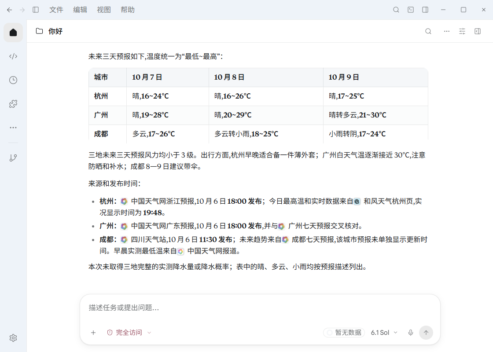

# MiniCode

MiniCode 是一个本地运行的 AI 编程助手，包含 Python 后端、React + Vite 前端和 Electron 桌面端。它提供工作区管理、代码编辑、终端、预览以及多模型对话能力。



完整回复后自动收起工具过程，点击可查看执行记录；子任务的工作记录在侧栏独立呈现，Diff 按文件展开。代码工作区提供 Monaco 编辑器、LSP 补全与导航，默认显示代码缩略图。

截图在 2026-10-08 最新 Windows 桌面包中拍摄，展示真实历史会话的完成记录。本次修复归档与会话切换延迟，工作区索引采用共享扫描及完整取消生命周期；修复范围、测试结果及验证边界见[本次验收记录](docs/validation/2026-10-08-archive-editor-performance.md)。此前真实多 agent、Mermaid 和 Diff 的验收见[发布记录](docs/validation/2026-10-07-release-closure.md)。

## 环境要求

- Python 3.11 或更高版本
- Node.js 20.19 或更高版本
- npm
- Windows、macOS 或 Linux

## 安装

在项目根目录执行：

```bash
python -m venv .venv
```

Windows：

```powershell
.venv\Scripts\Activate.ps1
pip install -e .
cd frontend
npm ci
cd ..\desktop
npm ci
```

macOS/Linux：

```bash
source .venv/bin/activate
pip install -e .
cd frontend && npm ci
cd ../desktop && npm ci
```

## 启动开发环境

Windows 可直接运行：

```bat
start.bat
```

macOS/Linux 可运行：

```bash
bash start.sh
```

也可以分别启动前端和桌面端：

```bash
cd frontend
npm run dev
```

然后在另一个终端执行：

```bash
cd desktop
npm run start:client:devfrontend
```

## 构建

构建前端：

```bash
cd frontend
npm run build
```

构建桌面端目录：

```bash
cd desktop
npm run pack:dir
```

生成 Windows 安装包：

```bash
cd desktop
npm run dist:win
```

## 项目结构

```text
backend/    Python 后端与 WebSocket 服务
frontend/   React + Vite 前端
desktop/    Electron 桌面端
scripts/    开发和构建辅助脚本
skills/     项目内置技能
```

## 配置

模型服务和运行参数通过环境变量或本地配置文件设置。敏感配置请放在 `.env` 或 `config.local.toml` 中，不要提交到仓库。

## 许可证

当前项目未声明开源许可证。
