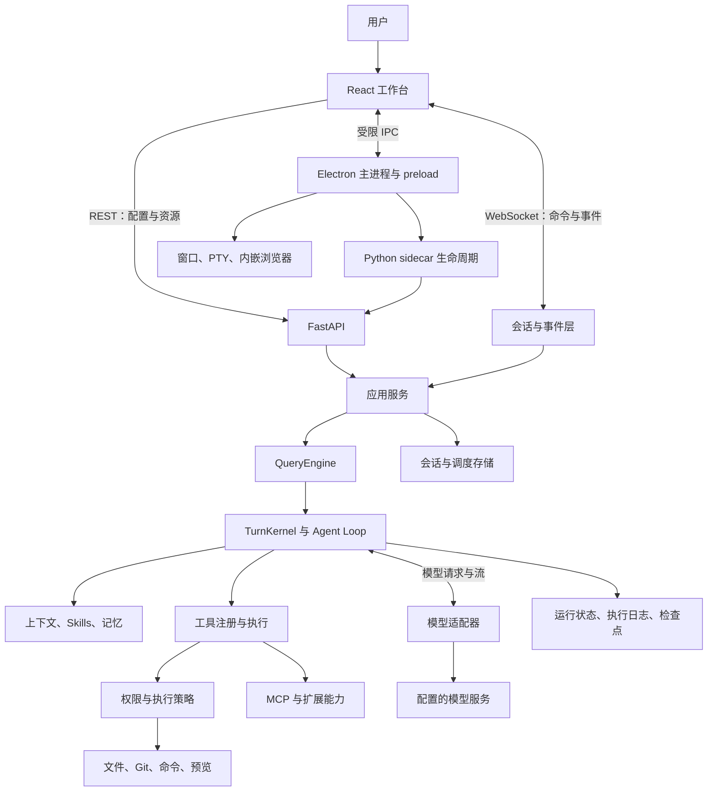
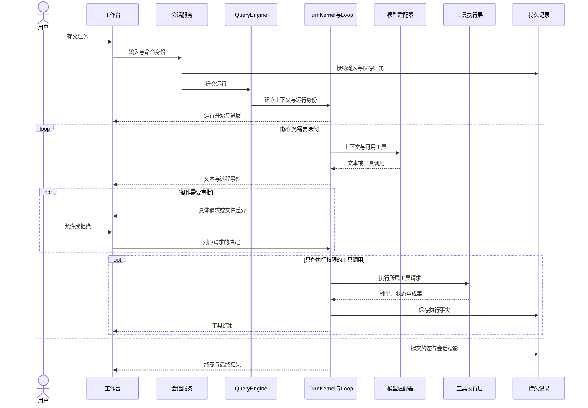
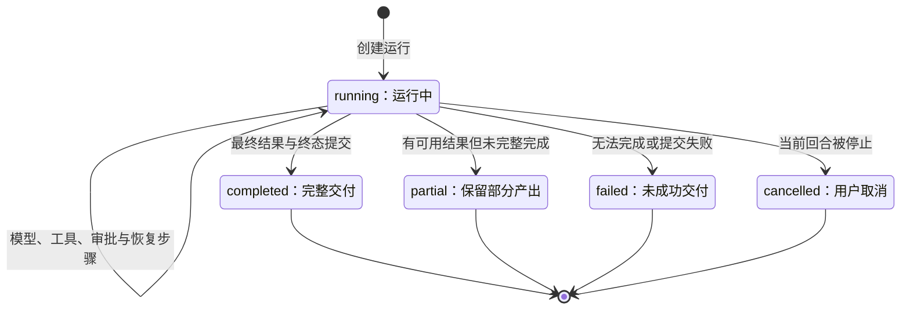
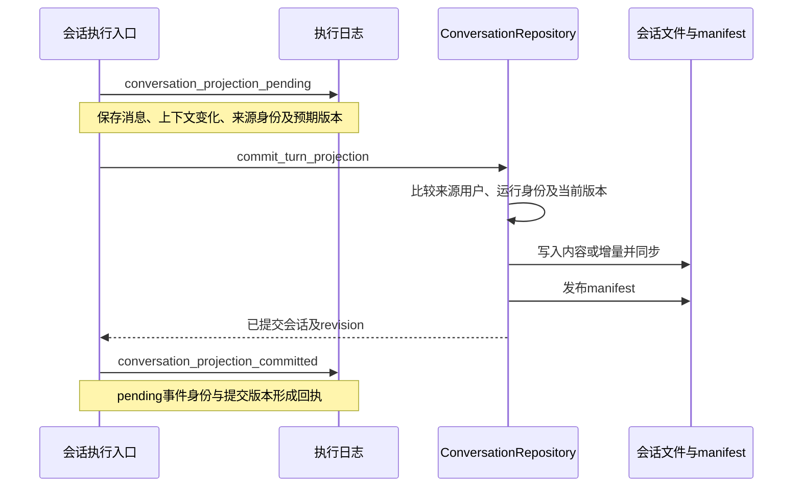

# MiniCode 编程工作台设计文档

> 以任务为中心，将 AI 对话、代码修改、运行验证和变更审阅组织为连续的本地开发流程。

| 项目 | 内容 |
| --- | --- |
| 文档版本 | 1.1 |
| 产品基线 | MiniCode 0.2.0 |
| 编写日期 | 2026-10-03 |
| 文档用途 | 产品设计、架构评审、开发协作与版本验收 |
| 适用读者 | 产品负责人、交互设计师、前后端开发者、测试与发布负责人 |
| 实现依据 | 当前工作目录中的源码、依赖配置及已有工程文档，包含未提交修改 |

本文以当前实现为基础，给出产品总体设计与关键链路的详细设计。标记为“现状”的内容可以在源码中定位；“设计要求”用于约束体验和实现；“演进建议”属于后续工作。性能指标是建议验收目标，尚未作为本次文档编写的实测结果。

阅读时可按职责进入：交互设计重点看第 3、4、12 节；执行实现重点看第 5—8 节；接口与持久化重点看第 9—11 节；开发验收与发布重点看第 13—15 节。字段表选择影响跨模块协作的核心字段，不取代源码中完整的类型定义。

## 目录

1. [产品定位与设计目标](#1-产品定位与设计目标)
2. [能力范围与产品边界](#2-能力范围与产品边界)
3. [信息架构与工作台布局](#3-信息架构与工作台布局)
4. [核心用户流程](#4-核心用户流程)
5. [总体技术架构](#5-总体技术架构)
6. [领域模型与状态归属](#6-领域模型与状态归属)
7. [Agent 执行设计](#7-agent-执行设计)
8. [上下文与模型接入](#8-上下文与模型接入)
9. [通信协议与会话恢复](#9-通信协议与会话恢复)
10. [存储与资源生命周期](#10-存储与资源生命周期)
11. [权限与执行环境](#11-权限与执行环境)
12. [视觉系统与交互规范](#12-视觉系统与交互规范)
13. [性能与质量验收](#13-性能与质量验收)
14. [部署与发布设计](#14-部署与发布设计)
15. [关键设计决策与演进顺序](#15-关键设计决策与演进顺序)
16. [实现索引与文档维护](#16-实现索引与文档维护)

## 1. 产品定位与设计目标

### 1.1 产品定义

MiniCode 是本地运行的 AI 编程工作台。用户围绕一个项目提出任务，Agent 获取项目上下文、调用工具、修改文件并执行验证，用户在同一工作台查看过程、审阅差异、操作终端和继续迭代。

产品的核心价值是缩短从“表达意图”到“得到可检查成果”的距离。一次任务的交付应包含实际产出、验证证据和完成状态，代码、终端输出与对话结论之间能够相互定位。

### 1.2 用户与使用场景

| 用户 | 主要目标 | 工作台需要提供的支持 |
| --- | --- | --- |
| 独立开发者 | 完成小型应用、快速修复问题、减少工具切换 | 项目上下文、直接执行、预览与文件审阅 |
| 专业开发者 | 处理已有仓库中的功能、重构和缺陷 | 精确定位、Git 差异、可控权限、可追溯执行记录 |
| 学习者与原型开发者 | 理解代码并逐步形成可运行作品 | 清晰反馈、可见过程、关联代码和错误的解释 |
| 长任务使用者 | 让任务跨多个回合持续推进 | 持久会话、上下文压缩、运行恢复、排队输入 |

典型任务包括：理解仓库、实现功能、修复缺陷、运行测试、查看页面效果、审阅变更、生成项目成果，以及按计划执行项目任务。

### 1.3 设计目标

1. **任务形成闭环。** 用户从提出需求到检查成果，能够沿着同一任务连续工作。
2. **项目上下文准确。** 文件、工具、终端、模型配置与权限均有明确作用范围。
3. **过程可以理解。** 用户能够判断当前在连接模型、执行工具、等待审批还是已经结束。
4. **结果可以验证。** “已完成”对应实际产出与执行结果，部分完成和失败有独立表达。
5. **工作可以延续。** 切换模式、切换任务和短暂断线不丢失已提交记录与待处理交互。
6. **实现保持直接。** 修改问题时修复完整链路，避免通过界面补丁掩盖运行或存储错误。

### 1.4 工程原则

| 原则 | 实施要求 |
| --- | --- |
| 从用户任务判断完整性 | 同时检查执行、落盘、事件传输和界面呈现，不能只证明某个函数返回正确 |
| 状态有明确负责人 | 对话、运行、连接和界面偏好分别由对应模块负责写入 |
| 用户掌握执行控制 | 权限选择、审批、停止与排队输入的效果明确可见 |
| 本地持有项目与历史 | 项目文件和运行记录由本地工作台管理；模型及联网工具按需调用外部服务 |
| 不做防御性编程 | 域内依赖明确契约；不添加无依据的重复校验、通用异常吞噬、协议猜测或静默兜底 |
| 一轮完成后统一验证 | 先补齐同一需求的完整功能，再集中补充有价值的测试和运行必要检查 |

## 2. 能力范围与产品边界

### 2.1 当前能力地图

下表描述源码中已有的能力入口。具体可用性还取决于模型、系统环境、配置和功能开关。

| 能力域 | 现状 | 用户价值 |
| --- | --- | --- |
| 项目与工作区 | 打开项目、文件树、搜索、工作区上下文、Git Worktree | 为任务绑定可操作的代码环境 |
| 对话与任务 | 流式回答、任务历史、归档、输入队列、侧聊 | 保留需求与执行结果，支持持续迭代 |
| 代码编辑 | Monaco 编辑器、文件标签、Agent 修改块的保留与撤销 | 直接检查和处理代码变更 |
| 执行与验证 | 命令执行、交互式终端、后台命令、运行输出 | 将修改转化为可观察的运行结果 |
| 变更审阅 | 回合差异、Git 差异、文件写入审批、文件检查点 | 判断改动范围并支持恢复 |
| 浏览器与预览 | 内嵌浏览器、浏览器控制、预览服务、成果预览 | 检查网页行为和生成内容 |
| Agent 编排 | 主 Agent、子 Agent、任务与团队记录、消息传递 | 承载复杂任务的分工与进度 |
| 模型服务 | OpenAI Chat / Responses、Anthropic Messages、自定义服务接入 | 在统一工作台使用不同模型能力 |
| 扩展能力 | Skills、插件、MCP 工具、资源与提示词 | 接入专业流程及外部能力 |
| 持续任务 | 定时任务、关联会话的持续检查、执行记录 | 自动推进有明确项目归属的工作 |
| 上下文与记忆 | 上下文预算、压缩、运行检查点、文件记忆 | 支持长任务并降低重复说明成本 |

### 2.2 产品边界

MiniCode 的主要交付形态是本地桌面应用，当前安装包配置以 Windows x64 为明确目标。仓库同时包含其他系统的开发与执行路径，跨平台支持程度应以对应平台的实际验收为准。

“本地运行”指工作台、项目操作和状态管理在本机完成。调用模型、联网搜索、远程 MCP 服务等操作仍可能向配置的外部服务发送必要内容。

编辑器和语言工具服务于任务执行与审阅。当前设计优先完善 AI 开发流程，完整 IDE 的插件生态、全套调试器和远程协同编辑可以按实际需求演进。

定时任务依赖后端进程运行。当前桌面退出流程会停止 sidecar；Windows 下关闭全部窗口会退出应用。因此，现有调度能力不应被描述为“退出应用后仍常驻执行”的系统服务。

### 2.3 完成的定义

一个编程任务满足下列条件，才可以向用户呈现为完整交付：

- 需求对应的文件、代码或其他成果已经形成。
- 与变更相关的必要验证已经执行，并保留结果。
- 用户能定位修改范围、成果位置和未解决事项。
- 运行状态、对话记录和界面终态一致。
- 未完成、被中断、受阻或部分产出的情形得到如实标记。

## 3. 信息架构与工作台布局

### 3.1 工作台结构

工作台由顶部栏、左侧导航、中心工作区、右侧辅助面板和底部工具区组成。

```text
┌──────────────────────────────────────────────────────────────┐
│ 顶部栏：当前项目 · 面板控制 · 命令面板 · 连接状态 · 窗口控制  │
├──────────────┬────────────────────────────┬──────────────────┤
│ 左侧导航     │ 中心工作区                 │ 右侧辅助面板     │
│ 协作 / 代码  │ 当前任务标题               │ 活动 / 差异      │
│ 新建任务     │ 对话 / 文件标签切换        │ 预览 / 浏览器    │
│ 已安排       │ 回答、过程、工具与成果     │ 子 Agent / 成果  │
│ 插件与项目   │ 输入框、附件、上下文选择   │ 检查 / 诊断      │
│ 任务或文件树 ├────────────────────────────┤                  │
│ 设置与主题   │ 底部：终端 / Git / 用量 / 调试                │
└──────────────┴────────────────────────────┴──────────────────┘
```

示意图表达信息职责，实际面板可收起；右侧工具按当前任务需要打开，底部工具只在需要时展开。

### 3.2 两种主要工作模式

| 模式 | 左侧内容 | 中心内容 | 适用工作 |
| --- | --- | --- | --- |
| 协作 `cowork` | 任务与会话列表 | 以对话为主，查看执行过程和成果 | 提出需求、推进任务、查看结论 |
| 代码 `code` | 项目文件树 | 对话与文件标签切换，聚焦代码编辑 | 阅读文件、手动修改、审阅 Agent 变更 |

**现状：** 主导航提供“协作 / 代码”两个入口。类型定义中仍有 `chat` 模式，不应据此把当前导航描述成三个并列入口。工作台主入口使用中心标签切换，`MainSlots` 同时保留分栏布局能力。

**设计要求：** 模式切换只改变关注点。当前任务、输入草稿、已打开文件、对话滚动位置和运行中的交互应保持连续。当前中心实现会在编辑器展示时保留对话树挂载，为这种连续性提供基础。

### 3.3 区域职责

| 区域 | 主职责 | 设计要求 |
| --- | --- | --- |
| 顶部栏 | 项目身份、全局入口、窗口与连接控制 | 项目名称可识别，连接问题有明确状态和可执行操作 |
| 左侧导航 | 切换任务或定位文件 | 全局入口稳定；任务列表与文件树随模式切换 |
| 中心工作区 | 处理当前任务与文件 | 保持主任务阅读空间；回答、执行过程和代码有清晰层次 |
| 右侧面板 | 查看与任务关联的证据和工具 | 内容归属清楚，打开详情后仍能回到原任务 |
| 底部工具区 | 操作终端、Git、用量与调试 | 支持收起和高度调整，不挤占常态阅读空间 |
| 设置中心 | 配置模型、外观、权限及扩展 | 配置来源、生效范围和保存状态可理解 |

### 3.4 布局参数与窄窗口

**现状参数：** 左侧栏实际展开宽度为 272px，当前不提供拖动调宽；右侧默认宽度为 380px，并按浏览器、差异、预览等内容使用不同宽度；工作台宽度不超过 1199px 时进入紧凑布局，左右侧栏以抽屉形式呈现。`MainSlots` 另有 900px 的内部布局判断，两者负责不同层级。

**设计要求：** 窄窗口优先保留中心任务区域。抽屉支持键盘关闭、焦点约束和返回原入口；面板内容不应因为窗口变窄而失去所属任务或未提交输入。

### 3.5 核心界面的状态与操作契约

下表把界面区域细化到开发组件。组件读取或生成界面状态，服务端仍负责接纳输入、执行和提交事实。

| 组件或入口 | 输入与依赖 | 主要操作或输出 | 连续性要求 |
| --- | --- | --- | --- |
| `ConversationsTab` | 会话摘要、当前会话身份 | 创建、选择、归档、管理任务 | 列表选择与已切换完成分别表示 |
| `FileTree` | 当前工作区、目录与搜索结果 | 展开目录、打开文件、文件操作 | 文件操作指向发起操作时的项目 |
| `ChatPane` / `ChatTurn` | 当前会话消息、回合状态、运行事件 | 呈现回答、工具、过程和成果 | 根据消息身份更新同一回合，恢复后仍能定位原记录 |
| `Composer` | 草稿、附件、上下文选择、模型与权限 | 发送、排队、补充当前任务、停止 | 未提交输入和已接纳输入有区别，切换任务保留相应草稿 |
| `InlineAgentPrompt` | 当前待决请求及后续队列 | 允许、拒绝、附带说明 | 服务确认决定后才完成本地交互；失败时保留请求和说明 |
| `EditorPanel` | 打开文件、编辑缓冲区、回合差异 | 保存、导航变更块、保留或撤销 | 用户未保存编辑与磁盘变化需要分别处理 |
| `DiffPanel` | 本次请求或任务的差异及文件身份 | 审批、查看、行评论 | 明确是审批视图还是执行后的审阅视图 |
| `TerminalPanel` | 终端会话清单、活动会话、输出 | 创建、输入、调整尺寸、结束终端 | 输出归属原终端，会话结束后不继续接受输入 |
| `BrowserPanel` / `PreviewPanel` | 浏览器目标、预览资源或服务、所属会话 | 导航、查看页面、检查预览 | 保留与任务关联的目标，不以另一项目当前 URL 覆盖 |
| `SettingsCenter` | 配置、来源、加载与保存状态 | 修改设置、连接服务、刷新能力 | 打开时读取当前配置，同次打开内切换页面复用有效数据 |

**交互设计要求：** 为每个会产生持久影响的动作区分“已提交请求”“请求被接受”“结果已生效”。按钮按下只是第一步；界面不能仅凭本地动画把保存、审批或任务完成显示为成功。

### 3.6 主操作的反馈矩阵

| 操作 | 操作前 | 处理中 | 成功后 | 未成功时 |
| --- | --- | --- | --- | --- |
| 发送任务 | 输入可编辑，显示所属项目 | 生成本地消息身份，显示提交或运行反馈 | 接纳身份与服务端运行对应 | 保留用户内容，显示原因和合适的重新提交入口 |
| 切换任务 | 明确目标任务 | 展示切换中的目标，避免误把旧历史当新历史 | 目标历史、项目和待决交互一致 | 保留可理解的当前状态，显示切换结果 |
| 保存文件 | 展示未保存状态 | 保留本次保存的文件及内容身份 | 保存结果对应磁盘和编辑缓冲区 | 保留未保存内容，说明实际失败 |
| 允许或拒绝 | 完整展示具体请求 | 防止同一请求重复提交决定 | 根据服务结果关闭或更新请求 | 请求留在原任务，可修正说明并再次处理 |
| 停止 | 当前回合有明确停止身份 | 显示正在结束，处理所属资源 | 回合转为中断或取消，保留已有结果 | 说明尚未结束的资源或提交问题 |
| 打开成果 | 有有效资源引用 | 显示加载反馈 | 显示对应文件或媒体 | 显示资源不可读的实际原因 |

## 4. 核心用户流程

### 4.1 打开项目并开始任务

1. 用户打开项目，工作台显示项目名称与文件树。
2. 用户新建任务，选择模型与执行权限，输入目标和必要约束。
3. 工作台展示本次任务关联的项目、附件与显式上下文。
4. 后端接纳输入，创建运行身份，Agent 获取上下文并开始执行。
5. 用户查看进度、审批需要确认的操作，必要时追加要求。
6. Agent 形成成果与验证结果，工作台显示终态和变更入口。

首次使用需要配置模型服务。配置错误应直接关联到模型设置入口；项目不可用应关联到项目选择，避免把两类问题都呈现为同一个“请求失败”。

### 4.2 实现功能或修复缺陷

| 阶段 | Agent 行为 | 用户看到的内容 | 完成依据 |
| --- | --- | --- | --- |
| 理解 | 阅读指令、定位相关文件、理解现有行为 | 当前目标与简洁进展 | 明确修改范围及用户约束 |
| 实施 | 完成同一需求的代码与关联改动 | 文件修改、工具活动、必要审批 | 主路径与相关链路均已补齐 |
| 验证 | 集中执行与变更相关的检查 | 命令、退出状态、测试或运行结果 | 验证结果对应实际修改 |
| 审阅 | 汇总变更和证据 | 回合差异、编辑器变更块、成果入口 | 用户可以检查和保留或撤销改动 |
| 交付 | 给出结果与剩余事项 | 简洁结论、成果位置、明确终态 | 记录和运行终态一致 |

例如，修复一个“发送后界面无反应”的问题，需要检查输入接纳、运行创建、事件发出、状态投影和界面反馈。仅让按钮出现加载动画不能视为完成。

### 4.3 计划与审批

计划流程先明确目标、涉及范围和验证方式，再进入执行。Agent 行为模式 `build / plan / review / explore` 与权限模式是两个维度：前者表达任务意图，后者决定工具能否执行及是否需要审批。

审批交互需要展示具体动作、目标路径或参数、相关差异及用户决定。批准对应当前请求；拒绝后的原因需要进入执行结果，帮助 Agent 调整下一步。恢复会话时，同一待决审批只能形成一个有效交互。

写入前的差异审批、执行后的变更审阅、文件检查点恢复和 Git 差异属于不同操作。界面文案需要明确操作会影响“待执行请求”“当前编辑内容”还是“项目版本”。

### 4.4 运行中追加要求与停止

用户在执行过程中可能补充约束、发送下一条任务或点击停止。三者需要有不同语义：

| 操作 | 设计语义 |
| --- | --- |
| 调整当前任务 | 在运行边界接纳补充输入，归入当前回合的上下文与记录 |
| 排队发送 | 保存为后续输入，展示队列顺序和提交状态 |
| 停止当前运行 | 请求取消当前回合及其所属工作，保留已有产出与中断原因 |

点击停止后，不能因为队列里还有消息就立即重新开始执行；恢复排队执行应由明确操作或协议状态驱动。重复点击停止应继续指向同一次运行。

### 4.5 断线与继续工作

连接中断时，工作台展示连接状态并保留已有内容。重连后恢复当前任务、耐久记录、运行快照与待决交互；回放事件和快照共同恢复视图。

连接恢复、读取历史和恢复执行是三个动作。读取历史不会自动重新执行旧命令；恢复中断运行应使用对应检查点，并重新取得当前工作区和运行依赖。

### 4.6 安排项目任务

用户为任务指定项目、时间规则、时区、权限和隔离方式。触发后，调度器通过独立执行入口运行 Agent，并保存执行记录与关联会话。界面展示下一次触发时间、上次结果和错误原因。

**现状：** 调度执行不依赖当前 WebSocket 连接，并复用 QueryEngine 路径；新任务具有 Worktree 隔离设计。执行仍依赖后端存活，关闭或退出行为遵循第 2.2 节的产品边界。

### 4.7 手工编辑与 Agent 修改同时发生

**现状：** 编辑器保存会捕获本次的文件路径、工作区、原始内容、内容哈希与待保存文字，通过后端 `compare_and_write_file` 进行比较写入。桌面模式下也走这条后端保存路径。

1. 用户打开文件，编辑器记录磁盘内容及 `content_hash`，作为当前编辑基线。
2. 用户修改缓冲区，未保存状态由当前内容与基线是否相同决定。
3. 用户保存时，固定这一请求的路径、项目、基线哈希与内容。
4. 后端比较当前磁盘版本与预期哈希；一致才写入，不一致返回冲突。
5. 成功回执只把本次实际保存的内容更新为基线。保存途中用户继续输入的内容保留，因此标签可能仍是未保存状态。
6. 发生冲突时保留用户缓冲区、标记外部变化并提示读取或比较，不直接覆盖 Agent 或外部工具的新修改。

**设计要求：** 操作发出后切换文件或项目，迟到保存结果仍归属原文件，不更新当前新标签的状态。撤销 Agent 修改应作用于当前可匹配的变更块，与整份文件恢复和 Git 回退采用不同入口。

### 4.8 终端与后台命令的连续性

交互式终端服务于用户持续输入；一次 Agent 命令服务于当前工具调用；后台命令具有独立执行与完成通知。它们可以在同一个面板被查看，但不是同一生命周期。

**现状：** 桌面 PTY 由 Electron 管理，前端通过桌面桥接收输出，并经 `terminal.mirror.created / output / exit` 将相关状态镜像到后端。镜像命令沿用所属会话；获取终端清单与输出快照用于重新建立视图。

终端输出事件具有 `start_cursor / end_cursor`，快照具有 `output_start_cursor / output_end_cursor`。重连时将快照与已经收到的新输出按游标拼接，不能简单重复追加整份快照。用户清空可见输出后也保留游标，旧快照不应把已清空的内容重新带回来。

用户应看到 shell、工作目录、运行或退出状态及退出码。`pty / pipe` 执行模式会影响交互能力，界面应表达实际模式。终端仍在显示时关闭任务、结束进程或退出应用，必须遵循其所有者的资源结束规则。

### 4.9 页面预览与成果预览

| 类型 | 输入 | 准备过程 | 成功依据 |
| --- | --- | --- | --- |
| 运行中的网页 | 启动配置、命令、项目与预期 URL | 启动服务、读取输出、发现 URL 或端口、确认可访问 | 进程状态与访问结果均可观察 |
| 成果文件 | artifact 或工作区文件引用 | 获取正文、选择对应解析或预览方式 | 所属资源可读取，预览结果对应文件 |
| 内嵌浏览器目标 | 页面 URL、浏览器目标与所属任务 | 创建或定位浏览器表面，导航并检查页面 | 目标存在且属于当前要检查的任务 |

预览服务进程保存 session、会话和工作区身份，也保留 `cleanup_pending / cleanup_reason`。服务启动中、就绪、退出或尚未确认结束需要区别呈现。进程输出中出现 URL 只是定位信息，实际页面可用性由相应检查结果证明。

### 4.10 调度任务的配置与执行记录

| 配置字段 | 含义与当前约束 |
| --- | --- |
| `name / prompt` | 用户可识别名称和可独立执行的任务说明 |
| `schedule` | 五字段 cron 表达式，需能计算下一次触发 |
| `timezone` | IANA 时区；前台创建的服务入口缺省使用 UTC，显式选择 `Asia/Shanghai` 才按上海时间解释 |
| `workspace_root` | 任务绑定项目，切换前台项目不改变绑定 |
| `conversation_id` | 指定关联会话时使用该会话；不存在、已归档或归属错误需要明确失败 |
| `permission_mode` | 调度运行采用的权限，按调度服务的允许规则解释 |
| `isolation` | `worktree / workspace`；新创建默认 Worktree，旧记录迁移保留原有语义 |
| `enabled / recurring / auto_expire` | 是否启用、是否重复及自动到期行为 |

当前调度器最多保有 50 个有效任务。Agent 创建的重复任务具有自动到期设计，用户建立的任务保留到明确删除；这两类生命周期应在对应入口得到解释。

执行记录保存调度时间、开始与结束时间、结果状态、关联会话、实际工作区、结果摘要和错误。用户可以区分“任务规则已保存”“本次触发开始”“这次执行成功”，失败或手动重试也作为执行记录处理。

## 5. 总体技术架构

### 5.1 架构形态

MiniCode 采用 Electron 桌面壳、React 渲染前端与 Python sidecar 后端。后端是按领域划分的单体应用，通过 REST 和 WebSocket 提供能力；模型、MCP 服务及项目工具位于执行边界之外。



图中箭头表示主要职责关系。命令、终端及浏览器在桌面桥和后端执行层之间存在专门协作路径，具体依赖以对应服务实现为准。

### 5.2 技术选择

| 层级 | 当前技术 | 选择理由 |
| --- | --- | --- |
| 桌面应用 | Electron 43、Node.js、preload / IPC | 统一桌面窗口、浏览器与本地系统集成 |
| 界面 | React 18、TypeScript、Vite 8 | 支持组件化工作台、类型化协议与按需加载 |
| 前端状态 | Zustand 5，按领域拆分 slice | 让对话、编辑器、权限和布局状态有清晰入口 |
| 编辑器与终端 | Monaco、xterm.js、node-pty | 提供成熟的代码编辑与交互式终端能力 |
| 后端 | Python 3.11+、FastAPI、asyncio、Uvicorn | 统一异步模型请求、工具执行和 WebSocket 服务 |
| 数据存储 | JSON / JSONL、SQLite、文件 blob | 匹配本地历史、追加证据与关系状态的不同用途 |
| 模型与扩展 | OpenAI / Anthropic SDK、MCP SDK | 在应用内统一服务协议与扩展生命周期 |
| 内容呈现 | Markdown、KaTeX、Mermaid、PDF.js | 呈现开发说明、公式、图示与文件成果 |

### 5.3 依赖边界

- **前端**负责交互、布局、事件投影和状态呈现，依赖明确的服务协议。
- **桌面主进程**负责窗口、sidecar、PTY、浏览器与系统能力；渲染端通过受限桥调用。
- **API / WebSocket 层**负责接纳请求、连接生命周期、命令关联和事件交付。
- **应用服务层**负责组合会话、工作区、配置、检查点和调度能力。
- **Agent 层**负责一次运行的模型与工具循环、上下文和终态。
- **工具与适配器层**封装具体执行能力，不自行承担另一套任务生命周期。
- **存储层**负责所属数据的持久提交、读取和恢复。

跨层协作传递明确的执行上下文。不能通过“当前全局项目”推断一个已在运行的任务属于哪个工作区。

### 5.4 模块级职责与调用关系

| 模块 | 负责什么 | 主要协作方向 |
| --- | --- | --- |
| `useWebSocket` | 连接、心跳、重连、事件归一化和分发 | 接收服务事件，转交各领域 handler；发送客户端命令 |
| `ws-outbox` | 客户端命令 ID、待决结果及发送关联 | 为界面操作提供能等待服务结果的出口 |
| `chatStreamEvents` | 内容项与文本流投影 | 更新所属消息，完成对应文本项 |
| `runtimeEvents` / `sessionEvents` | 运行与会话恢复投影 | 更新运行状态、会话身份及历史 |
| `controlEvents` / `controlPlaneEvents` | 用户交互和控制状态投影 | 管理审批、询问、取消与已处理决定 |
| `SessionCommandDispatcher` | 接纳命令、去重、协调所属会话的操作 | 调用命令 handler 或进入运行管理路径 |
| `CommandScope` | 固定一次命令的任务、工作区和请求身份 | 将相同归属写入后续结果事件 |
| `SessionRunManager` | 运行句柄、取消信号、队列、领取与交付状态 | 启动执行、递送输入、结束与释放所属运行 |
| `AgentSession` / `QuerySubmission` | 组织执行依赖及一次输入的覆盖参数 | 进入 `QueryEngine.submit()` |
| `QueryEngine` | 建立回合、选择执行路径、组织终态交付 | 组合上下文、TurnKernel、Loop 和终态事务 |
| `TurnKernel` | 一个回合的生命周期、输入仲裁和运行终态 | 使用 AgentRuntime，并对工具和模型步骤提供回合身份 |
| `QueryTerminalTransaction` | 终态判定、提交、检查点与证据协调 | 记录意图、提交运行、生成完成及终止事件 |
| `QueryJournalRecorder` | 把执行事件组织为耐久证据 | 使用 ExecutionJournal 保留工具对、终态与恢复输入 |
| `ConversationRepository` | 会话接纳、公开历史、版本和投影发布 | 服务层提交用户输入、助手结果及上下文变化 |
| `EventOutbox` | 当前连接的排序、交付与耐久回放 | 为恢复提供事件链和提交状态 |
| `ToolRegistry` / 工具执行层 | 目录、能力描述、执行与结构化结果 | 连接权限、系统执行和上下文观察 |
| `ModelExecutionSnapshot` | 固定一个模型步骤及其工具调用的模型选择 | 保持配置、适配器与模型能力归属一致 |

从主用户路径看，关系是：`Composer → sendChatMessage → ws-outbox → SessionCommandDispatcher → SessionRunManager → QueryEngine → TurnKernel / Loop → 工具与模型 → 终态提交 → 会话投影与事件 → 前端领域 handler → ChatTurn / 面板`。

表中列出职责边界，不要求所有请求都经过每一个模块。例如读取历史通过 REST 和 Repository 完成，终端的交互输入经过专门的终端与桌面桥。

## 6. 领域模型与状态归属

### 6.1 核心实体

| 实体 | 关键标识或属性 | 职责与关系 |
| --- | --- | --- |
| Workspace | 项目根路径、Git 身份、可信状态 | 提供文件与工具作用范围；可关联多个任务 |
| Conversation | `conversation_id`、项目归属、标题、revision | 持有用户任务、公开历史和上下文状态 |
| Session | `session_id`、连接代次、回放游标 | 负责客户端连接与恢复；可切换会话 |
| Turn / Run | `turn_id` / `run_id`、所属会话、终态 | 一次输入对应的执行单元，连接消息、工具和证据 |
| Message | `message_id`、内容块、来源、终态 | 保存用户输入、过程信息和最终回答 |
| ToolCall | 调用 ID、工具名、参数、请求摘要、结果 | 关联审批、执行输出、产物和错误 |
| Approval | 请求身份、范围、决定 | 对一次具体能力请求形成用户决定 |
| Artifact / Attachment | 资源 ID、文件或媒体类型、所属任务 | 分别表达产出与输入材料 |
| Subagent / Task | 子运行、父运行、任务与结果身份 | 表达分工、依赖、进度和返回结果 |
| Checkpoint | 运行或文件检查点 ID、所属会话 | 支持运行恢复或文件回退，两类用途分离 |
| ScheduledTask / Run | 调度 ID、项目、时区、触发及执行记录 | 将时间规则转化为可追溯的任务运行 |

### 6.2 状态的唯一写入职责

系统不是把所有数据放进一份万能状态，而是为每类事实指定负责模块。

| 状态 | 权威负责人 | 其他模块如何使用 |
| --- | --- | --- |
| 会话历史与公开记录 | `ConversationRepository` | 前端读取并投影；服务提交所属回合结果 |
| Agent、子 Agent、任务与团队关系 | `AgentRuntime` / `SwarmStore` | 执行入口更新；界面和检查器读取公开投影 |
| 工具与生命周期执行证据 | `ExecutionJournal` | 支持检查、清理与待提交投影恢复 |
| 可恢复的模型上下文 | Agent 运行检查点 | QueryEngine 显式恢复，运行对象重新绑定 |
| 重连窗口与事件游标 | `EventOutbox` / `WebSocketReplayEventStore` | 会话恢复时回放并配合实时快照 |
| 用户输入队列 | 耐久队列与回合输入运行时 | 接纳、领取、完成及停止操作沿同一归属链进行 |
| 项目文件 | 文件系统及工作区服务 | 编辑器、工具、文件检查点和 Git 各按职责操作 |
| 界面偏好与交互状态 | 前端 store、UI 偏好服务 | 持有布局、主题、草稿和当前焦点 |

前端 store 中的执行状态是服务事实的视图。连接断开不能直接推导“任务失败”，同样，流式输出结束也不能直接推导“任务完成”。

### 6.3 必须保持的约束

1. 每个运行、工具结果和成果能定位到所属会话及工作区。
2. 切换项目不改变已启动运行的工作区身份。
3. 同一回合的最终状态、消息投影和持久记录一致。
4. 审批关联具体请求及参数，不能误用到后来的另一条调用。
5. 一条已接纳输入只有明确的消费归属；重连不能造成重复执行。
6. 运行检查点用于恢复上下文；执行日志用于保留事实；重连日志用于恢复连接视图。
7. 延迟到达的旧事件或旧写入不能覆盖新的任务状态与会话 revision。

这些约束属于领域设计，应由对应负责人实现，避免在每个界面组件或工具中复制一套判断。

### 6.4 会话字段与数据语义

会话不是只有一组聊天文字。当前 `ConversationRecord` 同时保存任务身份、项目关联、执行设置、公开历史及可恢复上下文。

| 字段组 | 当前核心字段 | 语义 |
| --- | --- | --- |
| 身份与展示 | `id`、`title`、`created_at`、`updated_at` | 稳定任务身份与列表展示元数据 |
| 版本 | `revision`、`content_revision`、`content_updated_at` | 全记录修改版本与内容修改版本分开，重命名不等于重新生成内容 |
| 模型选择 | `model_selection` | 保存会话关联的模型选择；执行步骤另有快照 |
| 会话类型 | `conversation_type` | `main` 或 `side_chat`，表达主任务与侧聊 |
| 权限 | `permission_mode`、`permission_previous_mode`、`permission_deny_rules`、`permission_overrides` | 当前模式、计划前模式和明确规则 |
| 记忆 | `memory_mode`、`memory_polluted`、`memory_pollution_sources` | 记忆启用状态与来源质量信息；侧聊缺省禁用记忆 |
| 历史与恢复 | `transcript`、`context_snapshot`、`message_count` | 公开消息与模型上下文分开；两者在提交时保持一致 |
| 汇总与压缩 | `summary`、`compaction_state`、`compaction_summary` | 任务摘要与压缩状态；不等同于最终回答 |
| 项目与隔离 | `workspace_root`、`git_branch`、`worktree_path`、`git_isolated` | 项目及当前操作检出的明确身份 |
| 持续目标 | `goal` | 与会话关联的目标信息 |
| 归档 | `archived`、`archived_at` | 任务列表生命周期信息，保留历史 |
| 分支关系 | `parent_conversation_id`、`parent_message_index`、`fork_id`、`branch_kind` | 从已有任务产生分支的来源 |
| 合并关系 | `merged_into_conversation_id`、`merged_at` | 记录分支结果的合并去向 |

`ConversationSummary` 是用于列表与轻量交付的投影，不携带完整的消息和上下文。界面列出任务时应读取摘要；打开任务和分页读取历史时再获得相应内容，避免为了更新标题反复传输完整长会话。

### 6.5 身份与版本的使用规则

| 身份 | 创建或绑定时机 | 必须沿用到哪里 |
| --- | --- | --- |
| `client_command_id` | 客户端发送一条操作时 | 接纳回执、重连补发与对应操作结果 |
| `user_message_id` | 前端准备本次输入时 | 接纳记录、输入消费归属与最终回合来源 |
| `assistant_message_id` | 前端准备对应助手消息时 | 流式内容、排队投影与公开助手记录 |
| `run_id` / `turn_id` | 运行被创建时 | 模型步骤、工具、预算、取消、证据与终态 |
| 工具调用 ID | 模型或执行运行时产生调用时 | 审批、结果、差异、输出及日志 |
| `request_id` | 一次审批或可关联操作建立时 | 对应控制响应或资源请求结果 |
| `revision` | 所属数据负责人提交时 | 更新前提、读取游标及防止旧投影覆盖新状态 |

`run_id` 和 `turn_id` 按具体事件与执行入口的契约使用，不要求所有路径把二者都作为独立字段生成。实现应沿用当前稳定身份，不从显示顺序、工具名称或标题推导执行身份。

### 6.6 消息、模型历史与执行证据

一条助手消息可以包含过程文字、最终文字、工具活动、图片和成果引用。当前设计至少有三种不同视图：

| 视图 | 消费者 | 需要保留什么 |
| --- | --- | --- |
| 公开消息与内容块 | 工作台、历史导出、用户复制 | 可见内容、明确来源、工具状态、成果与终态 |
| 模型历史 | 下一次模型调用、压缩、运行恢复 | 当前协议需要的消息与工具对，以及有效观察 |
| 执行证据 | 检查器、恢复服务、资源清理 | 请求身份、执行事实、关联状态与清理记录 |

最终文本的来源与完成状态共同决定能否成为可复制、可持久呈现的答案。`model_final / reply / partial` 与过程说明不是同一种用途。工具的完整输出可以保存在成果中，模型只接收摘要，但用户需要能够取得完整内容。

中断发生在尚无正文时，也要保留“这一回合被中断”的消息事实，不能只因为文字为空而从历史中删除助手记录。

## 7. Agent 执行设计

### 7.1 统一执行入口

**现状：** QueryEngine 组织任务提交、上下文建立、执行入口选择与终态事件；TurnKernel 管理回合身份、控制输入、权限刷新和终态提交；Agent Loop 负责模型调用与工具调用的迭代。

WebSocket 对话、REST 调用、SDK 与定时任务应复用共享的执行路径。不同入口可以采用不同交付方式，但运行记录、权限和完成语义需要保持一致。

### 7.2 一次回合的主流程



该图表示正常交付流程；取消、供应商错误与恢复路径也必须回到明确的终态处理。

### 7.3 工具执行

工具注册表提供文件读写与补丁、搜索、命令、终端读取、Git、LSP、Worktree、浏览器、预览、记忆、任务编排、计划和调度等能力。MCP 工具在服务连接后动态加入。

每个工具应声明参数、权限与副作用属性。执行层负责关联当前回合，处理审批和执行，形成结构化结果。面向用户的摘要与面向模型的观察可以采用不同投影，但需要对应同一次调用事实。

**现状：** `tool_exec / tool_wait` 提供代码单元编排。代码单元组合注册工具，内部调用仍沿用当前权限、事件和执行上下文；它与界面的“代码模式”是不同概念。选择输出进入模型历史可以控制上下文体积，完整执行事实仍由执行记录负责。

### 7.4 终态与进展

| 运行结果 | 用户含义 | 设计要求 |
| --- | --- | --- |
| `completed` | 本回合成功交付 | 已提交最终结果，关联必要证据 |
| `partial` | 保留了可用的部分产出 | 明确完成部分、停止原因与继续入口 |
| `failed` | 本回合未能成功交付 | 展示可理解原因，保留已有执行记录 |
| `cancelled` / `interrupted` | 运行被取消或中断 | 保留状态与已有产出，按具体事件契约解释 |

连接状态、供应商请求状态、工具状态和回合状态分别表达。等待模型响应、执行命令和等待审批应有不同反馈，避免用户把正常等待理解为界面卡死。

终态包含状态与原因。例如用户停止、预算终止、认证失败和模型流错误应能够区分。最终回答、过程说明和暂存文本也需要保留来源语义，防止把过程说明作为最终交付。

### 7.5 子 Agent 与后台工作

子 Agent 有独立运行身份、父运行关联、上下文和结果记录。任务完成通知必须进入所属父任务；共享任务与团队消息通过持久状态管理。

并行能力用于实际需要分工的任务。设计优先明确职责、输入、输出及修改范围；涉及同一文件的工作应由协调者组织，避免让多个执行单元同时争夺同一产出。

后台命令和子 Agent 是否随主回合停止，按其生命周期契约执行。界面应能说明哪些工作仍在运行，资源清理结果需要与所属任务对应。

### 7.6 运行状态与请求状态的转换

一个运行记录的 `phase` 使用 `plan / execute / recover / final`，`status` 使用 `running / completed / partial / failed / cancelled / interrupted`。阶段不是终态，也不是用户选择的 Agent 行为模式。

下面是运行终态的简化关系。分析、模型响应、工具执行、等待用户都属于运行期间的进展，不因此向持久运行枚举增加新的状态。



**现状：** TurnKernel 将 `cancelled / interrupted` 归一到回合 `terminal_status=cancelled`；运行记录和外围事件仍可能使用各自协议中的 `interrupted`。因此，显示“已停止”要读取状态及原因，不能只做字符串替换。

供应商请求另有 `connecting → responding → completed` 的生命周期；需要重试时转入 `reconnecting`，失败或用户中断分别结束为 `failed / interrupted`。第一次请求的 `retry_attempt=0`，用户界面不将它展示成“第 1 次重试”。请求进展通过 `operation_id` 关联同一个操作，不能每收到一次进展都追加一条新任务。

### 7.7 工具执行输入与结果契约

工具执行继承 `ToolExecutionContext` 中的权限、任务与回合依赖。`ToolCallSource` 表达 `direct / code_mode / extension` 来源，并携带父调用、代码单元或运行时调用身份，让嵌套调用仍能对应原任务。

| `ToolResult` 字段组 | 核心字段 | 消费方式 |
| --- | --- | --- |
| 模型观察 | `content`、`model_observation` | 作为模型下一步的观察或协议化结果 |
| 状态与错误 | `status`、`is_error`、`error_kind`、`provider_error_type`、`recoverable` | 区分成功、失败、超时、拒绝及可继续情况 |
| 用户说明 | `display_summary`、`user_summary`、`developer_detail`、`projection` | 工作台呈现摘要与按需技术详情 |
| 证据质量 | `source_url`、`evidence_type`、`extraction_status`、`limitation` | 联网或文档读取结果说明来源与提取情况 |
| 时间 | `duration_ms` | 工具耗时，不混入模型等待时间 |
| 产物 | `artifact_id`、`artifact_preview`、`artifact_kind`、`artifact_media_type`、`artifact_bytes`、`output_files` | 关联完整输出、文件及媒体预览 |
| 变更联动 | `superseded_tool_call_ids`、`removed_file_paths` | 处理被替代的调用与文件删除呈现 |
| 请求一致性 | `request_digest` | 把权限、批准、执行结果和日志对应到同一参数请求 |
| 清理证据 | `cleanup_receipt` | 标明结束、清理未完成或需要人工处理 |
| 进程内协作 | `runtime_metadata` | 仅供运行时交接，不当作公开消息序列化 |

`is_error` 与 `status` 对应不同层级：前者表示是否作为错误观察处理，后者保留具体结果分类。超时或取消不能直接等同于进程已经结束，需要同时读取清理证据。媒体二进制由资源存储持有，事件和记录优先携带有归属的引用。

### 7.8 排队、补充与停止的详细语义

**现状：** SessionRunManager 维护运行句柄与取消信号，耐久用户队列按会话共享；客户端耐久命令另按 session 管理。队列根从会话 Repository 的数据根派生，不能借用另一个环境的队列。

| 步骤 | 状态负责人 | 动作与约束 |
| --- | --- | --- |
| 保存待执行消息 | 耐久队列 | 持久保存命令及所属会话，不只保留在输入框或 WebSocket 内存缓冲中 |
| 领取消息 | 队列领取者 | 标明处理中命令及领取归属；多个连接不各自消费同一输入 |
| 接纳到运行 | RunManager / QueryEngine | 使用原用户与助手消息身份，形成运行和接纳证据 |
| 完成领取交接 | RunManager / 耐久队列 | 依据交接成功与否完成或重新放回，不由 UI 删除代替 |
| 补充当前运行 | `TurnInputQueue` / TurnKernel | 在明确执行边界消费输入，保留它进入当前回合的身份 |
| 停止与暂停 | RunManager | 固定本次被停止消息的暂停标记；普通待执行消息不自动绕过 |
| 明确继续发送 | 客户端命令与队列 | 新的显式发送与暂停标记建立关联，决定哪些输入可以推进 |

公开队列事件 `user_message.queue.updated` 使用 `queued / dequeued / cancelled`。队列位置、暂停状态、被调整的目标消息和回合方式由相关字段描述，不把所有内部领取状态都变成一个用户侧枚举。

停止命令携带 `conversation_id` 以及当前 `turn_id / message_id / task_id` 中适用的定位字段。这样，用户在旧回合界面点击的停止不会结束后来新建的回合。当前前端由 `buildInterruptCommand()` 从对应任务的流式助手消息构造命令。

### 7.9 执行终态提交的先后关系

当前 QueryEngine 通过 `QueryTerminalTransaction` 统一结束一次回合，关键顺序如下：

1. 读取最终输出、可见的非文本成果、工具状态与终止原因，确定完整或部分结果。
2. 对需要保留的检查点完成处理，记录其结果；保留失败会影响最终状态。
3. 把 `terminal_intent` 写入执行日志，保存状态、原因、助手身份、上下文与来源用户身份。
4. 由 TurnKernel 调用 AgentRuntime 提交运行终态，形成运行完成事件。
5. 根据已提交终态处理完成检查点，再记录运行提交回执、助手结果、未配对工具和清理证据。
6. QueryEngine 组织证据事件、完成事件与 `done`；会话执行入口负责将结果发布到所属会话。

运行提交失败时，终态改为 `failed / terminal_commit_failed`，不能继续声称“已完成”。日志写入问题作为独立证据返回；运行已提交、日志尚不完整与运行提交失败属于不同事实。

这是一条受协调的多存储提交链，不能把 SQLite、会话文件、JSONL 与 WebSocket 说成一个跨存储 ACID 事务。具体会话投影发布与崩溃恢复见第 10.5、10.6 节。

## 8. 上下文与模型接入

### 8.1 上下文来源

| 来源 | 内容 | 组织方式 |
| --- | --- | --- |
| 系统与运行指令 | Agent 角色、工具使用与行为约束 | 在统一提示构建入口组织 |
| 项目指令 | 工作区内适用的指令文件 | 按路径适用范围发现并注入 |
| 用户输入 | 当前目标、后续补充、显式约束 | 保留原始需求及消费归属 |
| 文件与附件 | 引用文件、选区、图片和文档 | 保留资源身份、来源与大小预算 |
| 历史与运行状态 | 对话历史、工具观察、计划和进度 | 使用所属会话和回合的数据 |
| Skills 与插件 | 专业工作流程与提供的能力 | 发现元数据，按需读取具体内容 |
| 记忆 | 文件记忆与相关索引 | 按当前任务需要选择，保留作用范围 |
| 工具目录 | 当前可用工具及参数定义 | 根据模型能力与运行策略形成快照 |

用户显式选择的内容和自动发现的上下文应能在检查视图中区分。配置或扩展更新在明确运行边界生效，避免执行中的任务混用两套工具目录或模型能力。

### 8.2 长上下文设计

系统维护上下文预算、供应商用量和压缩状态。预算应考虑系统提示、工具定义、Skills、历史、附件和输出预留；前端显示需要说明统计口径。

**现状：** 自动输出预留由 `TokenBudget` 统一计算为 `min(16384, total // 10)`，用户显式配置则保持其值。模型切换会重新解析上下文能力与预算。相关历史设计与修复记录见 [长会话压缩文档](docs/long-session-compaction.md)。

压缩保留目标、约束、已完成工作、关键上下文和下一步。工具观察可以裁剪或汇总，但不能因此把“尚未验证”改写成“已验证”，或丢失用户要求的精确文本。

本地估算用于预算管理，不代表供应商实际接收量。压缩策略、模型窗口与供应商报告应采用明确口径；不能在压缩成功后仅凭粗略估算反复终止可继续的运行。

### 8.3 模型服务适配

模型注册与适配器将服务身份、协议、认证、上下文窗口、推理参数和工具能力组织为明确契约。

| 协议 | 当前适配路径 | 设计要求 |
| --- | --- | --- |
| OpenAI Chat Completions | `OpenAIAdapter` 的 `chat` 路径 | 保持消息、工具与流事件的对应关系 |
| OpenAI Responses | `OpenAIAdapter` 的 `responses` 路径 | 保留响应项目、完成状态和所支持的原生能力 |
| Anthropic Messages | `AnthropicAdapter` | 按协议组织工具块、推理参数与输出配置 |
| 自定义模型服务 | 显式选择上述线协议及服务地址 | 服务品牌与协议类型分开配置 |

不通过一次失败猜测并切换另一种协议。不支持的能力应在设置或提交边界明确呈现；跨模型共用的是应用语义，协议细节由适配器负责。

### 8.4 Skills、插件与 MCP

Skills 提供可复用的工作说明；插件组织安装、启用与能力来源；MCP 连接外部工具、资源、资源模板和提示词。三者相互协作，各自保持清晰职责。

**现状：** SkillManager 支持发现和回合快照；PluginManager 提供统一插件状态；MCP 客户端具备 stdio、SSE、HTTP 和 WebSocket 传输入口，以及认证、生命周期和进展管理。

扩展状态需要说明来源、当前启用情况、所属项目及连接或认证问题。外部工具的能力声明不能自行代替用户授权，运行中的任务也不能因为用户切换项目而获得另一个项目的扩展状态。

### 8.5 上下文预算的计算口径

当前有“静态预算分配”和“实际请求输入估计”两种口径。前者控制可用于历史等内容的空间，后者决定当前即将发出的请求是否需要压缩。

设模型上下文窗口为 `T`，输出预留为 `R`，静态分项之和为 `S`：

```text
R = 用户显式配置的 response_reserve
    或 min(16384, floor(T / 10))

S = system_prompt + active_skills + memory_index
    + tool_schemas + agent_state

history_budget = T - S - R
compaction_trigger = max(0, T - R)
```

`TokenBudget` 默认分项为 `2000 + 4000 + 1000 + 6000 + 2000 = 15000`。这是静态规划参数，不表示每次请求真的耗用了这么多 Token。

| 示例窗口 | 自动输出预留 | 默认分项下的历史预算 | 实际压缩判断边界 |
| --- | --- | --- | --- |
| 32,000 | 3,200 | 13,800 | 请求 `used > 28,800` |
| 200,000 | 16,384 | 168,616 | 请求 `used > 183,616` |

实际请求估计使用已渲染的系统、开发者与历史消息，并加入当前工具 schema。已有供应商报告时，使用有符号校正：

```text
estimated = system_tokens + developer_tokens + history_tokens + tools_tokens

used = max(0, estimated + observed_actual - estimate_at_last_request)
       # 已有供应商用量及该次请求估计时

used = max(estimated, observed_actual)
       # 尚无有效校正锚点时
```

边界恰好相等时不触发压缩；超过边界才触发。上下文账本用于解释来源，可能与包含工具 schema 的输入预算有所不同。用量界面应说明“估计输入”“供应商报告”“历史压缩后大小”各表示什么，不能把它们当成相同数字。

### 8.6 模型步骤快照与配置生效

`ModelExecutionSnapshot` 捕获一个模型步骤的 `config / llm / provider / model / thinking_level`，并关联模型运行时、可用模型目录与元数据。工具执行沿用产生它们的模型步骤快照。

| 变化 | 生效原则 |
| --- | --- |
| 用户切换模型 | 由明确的模型更新路径建立新的选择，重新绑定适配器与预算 |
| 当前请求认证需要刷新 | 刷新该请求所用模型的凭据，保留同一模型身份 |
| 更新权限配置 | 通过回合权限刷新入口生效，不能由全局变量直接改变另一个任务的权限 |
| 安装、编辑或移除 Skill | 新运行边界重新发现，已在执行的快照保持一致 |
| 更新插件与 MCP 配置 | 更新所属管理器并发布生命周期或目录变化，保持工作区身份 |

模型配置来源也需区分“用户设置”“服务元数据”“有效运行值”。例如推理强度设置、实际支持的强度列表与当前有效强度可分别返回；界面应展示可用选择，而不是把未被模型支持的值当作已经生效。

### 8.7 配置层与项目可信状态

**现状：** `ConfigLayerStack` 保存来源、优先级、禁用原因与要求。按优先级合并，常用来源关系如下：

| 来源 | 优先级 | 设计语义 |
| --- | --- | --- |
| `system` | 10 | 系统默认设置 |
| `enterprise_managed` | 15 | 具备明确来源身份的管理配置 |
| `user` / 用户 profile | 20 / 21 | 用户持久配置及选择的 profile |
| `project` | 25 | 当前项目及适用目录的配置 |
| `session_flags` | 30 | 当前会话显式参数 |
| 兼容管理来源 | 40 / 50 | 现有管理配置兼容入口 |
| `policy` | 60 | 高优先级、只读管理策略 |

源码还定义 `mdm` 等来源；优先级表不是用户指令层级，也不能代替对受管理要求的独立处理。

项目配置沿项目根到当前目录发现 `.minicode/config.toml`。未获信任的项目配置、hooks 和执行策略具有明确禁用原因。设置中心通过配置层接口解释来源与作用范围；不得把项目文件里的配置当成用户已经主动授权的系统能力。

## 9. 通信协议与会话恢复

### 9.1 通信分工

| 通道 | 当前入口或载体 | 主要用途 |
| --- | --- | --- |
| REST | FastAPI 路由；包括 `POST /api/chat` | 配置、资源读取、管理操作与一次性调用 |
| WebSocket | `/ws` | 对话流、工具事件、审批、终端和会话命令 |
| 桌面 IPC | preload 暴露的受限接口 | 窗口、文件选择、PTY、内嵌浏览器及系统交互 |
| 本地关闭接口 | `POST /api/runtime/shutdown` | 让 sidecar 进入正常关闭流程 |

具体字段以 [后端协议](backend/ws/events.py) 和 [前端协议入口](frontend/src.v2/protocol/events.ts) 为准。新事件沿用现有命名体系与同步检查，避免自行推断未声明的字段和事件。

### 9.2 命令与事件关联

| 字段或标识 | 作用 |
| --- | --- |
| `client_command_id` | 把客户端命令与服务端结果对应起来 |
| `conversation_id` / `workspace_root` | 标明任务和项目归属 |
| `run_id` / `turn_id` / `message_id` | 定位所属执行、回合和消息 |
| 工具调用或审批身份 | 对应一次调用及其交互 |
| `event_id` / `seq` / `timestamp` | 标识事件、排序与时间 |
| `previous_replay_seq` | 表达耐久回放链的前序位置 |

字段按各类命令和事件契约携带，上表不表示每条消息都必须拥有全部字段。连接代次由运行时管理，用于阻止旧连接继续写入当前视图。

### 9.3 事件分类

| 类别 | 代表事件 | 主要用途 |
| --- | --- | --- |
| 文本与内容项 | `item.started`、`agent_message.delta`、`item.completed` | 构建有来源与状态的消息内容 |
| 工具与审批 | `tool_call`、`tool_output_delta`、`tool_result`、`permission.decision` | 展示执行和用户决定 |
| 运行与控制 | `agent.run.started`、`agent.run.completed`、`user_message.queue.updated` | 同步运行及排队输入 |
| 上下文与预算 | `context_usage`、`context_compacted`、`budget.warning` | 展示用量和压缩反馈 |
| 连接与会话 | `session.restored`、`conversation.switched`、`stream_resume` | 恢复会话、历史和进行中的视图 |
| 外围能力 | `terminal.output`、`file.changed`、`mcp.lifecycle` | 同步终端、文件与扩展状态 |
| 命令结果 | `command.result` | 返回可关联的操作结果 |

### 9.4 重连策略

1. 客户端保留有效的耐久游标和当前会话、项目身份。
2. 连接恢复后发送恢复命令。
3. 服务端回放仍可用的耐久事件，并发布会话及运行快照。
4. 客户端按事件身份和归属恢复投影，重建待决审批与队列视图。
5. 从当前状态继续交互，不重新执行已完成的工具。

`seq` 为事件排序提供依据，但高频瞬态事件不一定进入耐久日志，所以恢复不能要求每个收到的序号都连续落盘。回放链与运行快照各按自己的契约工作。

**现状：** EventOutbox 负责排序、交付与持久窗口。重连日志具有筛选和批量写入设计，进行中的内容由快照恢复；原始或隐藏的供应商推理内容不进入公开回放记录。实现背景见 [WebSocket 回放持久化](docs/ws-replay-persistence.md)。

### 9.5 关键 REST 接口

以下接口来自当前路由实现，是工作台核心链路的接口摘要。表格展示主要字段与行为，认证、资源作用范围及完整类型仍以路由和模型为准。

| 方法与路径 | 主要输入 | 主要输出或行为 |
| --- | --- | --- |
| `POST /api/chat` | `message`、可选 `conversation_id / max_iterations` | `reply / status / stopped_reason / iterations / tool_calls` 及错误、清理证据 |
| `GET /api/workspace/tree`、`GET /api/workspace/file` | 路径与明确的 `workspace_root` | 读取目录或文件，文件结果包含正文与内容哈希 |
| `PUT /api/workspace/file/compare-write` | `workspace_root`，body 中的 `path / expected_hash / content` | 按磁盘内容版本保存文件，冲突交由编辑器呈现 |
| `GET /api/conversations/{id}/messages` | `session_id`、`before_message_id`、`limit` | 返回一页公开消息及分页状态 |
| `GET /api/conversations/{id}/messages/{message_id}/tools` | `session_id`、`before`、`limit`、可选 `revision` | 按消息分页读取工具记录，关联对应版本 |
| `POST /api/uploads` | multipart `file`，query 中的 session、会话和项目身份 | 返回 `doc_id / artifact_id / attachment` 等资源引用 |
| `GET /api/attachments/preview` | 附件及所属资源请求参数 | 返回可用于预览的内容 |
| `GET /api/attachments/raw`、`GET /api/artifacts/raw` | 对应资源与授权参数 | 读取所属文件或媒体正文 |
| `GET /api/llm/settings`、`PUT /api/llm/settings` | 当前设置或新的模型设置 | 读取和保存模型服务配置 |
| `GET /api/settings/config-layers` | 设置查询 | 返回配置来源、有效层及相关信息 |
| `POST /api/llm/check`、`POST /api/llm/models/refresh` | 服务检查或模型目录请求 | 检查服务、刷新可用模型与元数据 |
| `GET /api/replay/{session_id}` | session 与读取参数 | 读取相应耐久事件窗口 |
| `GET /healthz` | 无业务输入 | 进程存活信息 |
| `GET /readyz` | 无业务输入 | 组件就绪；未就绪返回 HTTP 503 |
| `GET /api/status`、`GET /api/doctor` | 状态或诊断请求 | 运行概况、模型状态或聚合诊断 |

`/api/chat` 的 `message` 不能为空；`max_iterations` 缺省继承服务配置，显式 `0` 表示不设置宿主迭代上限。`ChatResponse.status` 使用 `completed / partial / cancelled / failed`，不能仅凭 HTTP 200 推断任务完整成功。

消息分页默认 `limit=80`、工具分页默认 `limit=40`，两者请求范围为 `1–200`。消息查询依赖有效 session，缺失会返回 404；分页锚点或版本冲突沿已有接口返回 409，客户端应重新取得相应历史，而不是跳到另一任务的页。

### 9.6 关键 WebSocket 命令字段

WebSocket 的传输对象采用扁平格式：顶层 `type` 加各字段。Python 中的 `AgentEvent.data` 与 `UserCommand.data` 是进程内组织方式，线上消息没有统一再套一层 `data`。

| 命令 | 核心字段 | 行为说明 |
| --- | --- | --- |
| `conversation.create` | 可选标题、类型、项目、权限、隔离选择 | 建立任务；明确绑定主会话或侧聊 |
| `conversation.switch` | `conversation_id` | 请求切换任务，服务返回对应状态与历史 |
| `user_message` | `content`，以及会话、项目、消息身份 | 提交输入，接纳后进入对应运行 |
| `user_message` 上下文 | `primaryFile / activeTabPath / attachments / skills / plugins` | 保留用户显式引用的来源 |
| `user_message` 运行控制 | `queue_if_busy / streaming_behavior / retry_from_message_id` | 指定排队、补充当前回合或基于原消息重试 |
| `user_message.queue.cancel` / `.steer` | 会话及 `message_id`，可选用户消息身份 | 取消排队项或将指定项调整为当前回合输入 |
| `interrupt` | 会话与当前回合或消息定位 | 停止目标运行，不以当前全局任务推断 |
| `control_response` | `request_id`、所属身份、嵌套的响应对象 | 返回审批、问题回答或其他控制决定 |
| `session.restore` | `last_seq / last_conversation_id / last_workspace_root` | 恢复耐久游标及任务、项目视图 |

`client_command_id` 是公共命令交付层补充的关联身份。`streaming_behavior` 当前支持 `follow_up / steer`；传入已在执行任务的普通消息，不自动等同于中断重启。

下面以一个已有会话中的任务为例。身份和路径为示例值，运行时按实际上下文生成：

```json
{
  "type": "user_message",
  "client_command_id": "cmd_design01",
  "conversation_id": "conv_design01",
  "workspace_root": "C:/work/demo",
  "content": "修复保存后重新打开文件仍显示旧内容的问题，并验证保存链路。",
  "permission_mode": "confirm",
  "agent_mode": "build",
  "user_message_id": "u_design01",
  "assistant_message_id": "a_design01",
  "queue_if_busy": true,
  "streaming_behavior": "follow_up"
}
```

对应接纳回执的关键部分：

```json
{
  "type": "client.command.ack",
  "client_command_id": "cmd_design01",
  "command_type": "user_message",
  "accepted": true,
  "duplicate": false
}
```

ACK 证明命令交付或接纳情况，运行开始、工具结果与终态仍由各自事件证明。`command.result` 使用 `command / level / message / data` 返回操作结果，不与助手的最终回答混用。

### 9.7 审批请求与响应示例

当前统一控制请求使用 `control_request`。`request.subtype` 包括工具审批 `can_use_tool`、用户询问 `elicitation`、模型认证提示 `provider_auth_prompt` 和会话资源清理请求。

工具审批的核心对象示例：

```json
{
  "type": "control_request",
  "request_id": "approval_design01",
  "conversation_id": "conv_design01",
  "turn_id": "run_design01",
  "message_id": "a_design01",
  "workspace_root": "C:/work/demo",
  "request": {
    "subtype": "can_use_tool",
    "tool_name": "run_command",
    "input": { "command": "python -m pytest tests/test_save.py" },
    "tool_use_id": "call_design01"
  }
}
```

拒绝并补充说明的响应示例，结构与 `buildApprovalResponseCommand()` 一致：

```json
{
  "type": "control_response",
  "client_command_id": "cmd_decision01",
  "request_id": "approval_design01",
  "conversation_id": "conv_design01",
  "turn_id": "run_design01",
  "message_id": "a_design01",
  "response": {
    "subtype": "success",
    "response": {
      "action": "reject",
      "feedback": "请先补齐保存与重载的改动，再统一执行相关测试。"
    }
  }
}
```

`response.subtype=success` 表示成功提交一个控制回答；是否允许工具由内层 `action=approve / reject / partial` 决定。文件分项决定使用 `decisions`，询问回答使用 `answer`，不能把外层 `success` 解读成自动批准。

### 9.8 重连配置、游标与恢复完成

当前前端连接策略的源码基线为：基础等待 1 秒、单次等待上限 30 秒、带抖动的退避、最多 5 次重连，以及 600 秒总预算；心跳间隔 10 秒，匹配 pong 的等待上限 60 秒。这些是客户端连接策略，供应商请求与 MCP 重连分别管理各自预算。

| 恢复字段 | 客户端需要理解的含义 |
| --- | --- |
| `last_seq / current_seq / replayed_events` | 服务接纳的游标、当前耐久位置与本次回放数 |
| `requested_last_seq / cursor_reset` | 请求游标与服务器有效位置不同，可能需要重置 |
| `event_log_gap / missed_events / snapshot_required` | 窗口不能覆盖全部变化，需要快照恢复 |
| `conversation_switched_follows` | 后续还会有任务切换状态，恢复过程尚未完整结束 |
| `session / conversation / workspace` | 重新建立当前运行、任务和项目视图的状态快照 |

恢复命令示例：

```json
{
  "type": "session.restore",
  "client_command_id": "cmd_restore01",
  "last_seq": 120,
  "last_conversation_id": "conv_design01",
  "last_workspace_root": "C:/work/demo"
}
```

恢复期间先建立所属会话，再重新取得需要的目录和状态、补发适用的待决命令。当前前端不会在恢复完成之前任意发送一份旧的任务列表请求，以免迟到列表把刚恢复的任务覆盖。对旧连接的事件、快照和 pending 结果，也需要根据相同归属规则处理。

## 10. 存储与资源生命周期

### 10.1 存储分工

| 数据 | 当前存储设计 | 用途 |
| --- | --- | --- |
| 会话 | manifest、分代元数据、转录与上下文投影日志、索引 | 历史查询、分页、版本归属与公开记录 |
| Agent 与协作关系 | SQLite `swarm.sqlite3` | 运行、子 Agent、任务、团队、消息与租约 |
| 执行证据 | 每个执行所有者的 `events.jsonl` | 记录工具与生命周期事实、辅助恢复提交 |
| 运行检查点 | 序列化的 Agent 上下文及状态 | 显式恢复中断运行 |
| 文件检查点 | 文件元数据与原始内容 blob | 在修改前记录文件，支持恢复 |
| 重连日志 | session 对应的 JSONL 窗口 | 支持断线回放，不代替永久对话历史 |
| 输入队列 | 耐久队列记录与领取归属 | 保存待执行输入、处理中输入及停止状态 |
| 配置与调度 | 分层配置、任务及执行记录 | 保存服务设置、项目绑定和触发状态 |
| 密钥 | OS credential store 与本地 vault 索引 | 持有模型或扩展所需凭据 |

文件系统与 SQLite 各负责适合的数据，不要求把所有记录迁入同一种存储。会话 revision、运行租约及输入消费归属解决各自的并发问题。

### 10.2 路径设计

**现状：** 桌面端将 Electron `userData` 作为 `MINICODE_STATE_ROOT` 传给后端。源码直接运行时，通用配置根默认是项目目录；Agent 运行根在没有显式配置时另有 `~/.minicode/data/agent-runtime` 默认值。

因此，定位数据时应使用模块定义的规范路径，不以开发环境目录结构推断安装版路径。项目文件、应用数据、扩展文件和临时执行目录分别管理。

### 10.3 提交与恢复

终态事实、会话投影和事件交付通过明确提交链协作。执行事实已经保存、会话投影尚未完成时，恢复服务可以重放适用的待提交投影；会话已推进到更新 revision 时，旧投影不能覆盖新状态。

Agent 检查点只保存可序列化内容。连接、终端管理器、工作区对象和权限对象等运行依赖，需要在恢复时重新建立。仅重放执行日志不能代替恢复模型上下文。

### 10.4 资源退出与归档

| 对象或动作 | 生命周期要求 |
| --- | --- |
| 归档会话 | 改变任务可见状态，保留可恢复历史；不等同于删除 |
| 删除会话 | 由所属服务处理记录、运行状态和关联资源，避免只移除列表行 |
| 停止回合 | 取消所属工作，保留已有事实与终态原因 |
| 关闭终端 | 结束对应 PTY 和进程，界面收到结束状态 |
| 浏览器与预览 | 保留明确所有者，结束或切换时按生命周期释放 |
| 临时目录与沙箱 | 对应本次执行，清理结果可追溯 |
| 退出应用 | 先处理终端、浏览器和 sidecar 的正常关闭，再退出主进程 |

长期保留的数据和短期恢复窗口采用各自策略。读取历史或导出日志不应顺带改写、缩短或删除原始记录。

### 10.5 会话文件结构与发布点

当前会话 manifest schema 为 `minicode.conversation.manifest`，写入版本为 8。分代文件与投影文件的名称示意如下，`N` 为具体基础代次：

```text
data/conversations/
  conv_design01.manifest.json
  conv_design01.gN.meta.json
  conv_design01.gN.transcript.jsonl
  conv_design01.gN.snapshot.json
  conv_design01.gN.projection.jsonl
```

其中基础代次保存完整元数据、转录和上下文；投影日志保存基于该代次的增量变化。manifest 指向读者应当看到的有效基础代次和已提交增量，不通过扫描“最后修改的文件”确定最新状态。

| manifest 字段 | 作用 |
| --- | --- |
| `schema / version / conversation_id` | 识别格式与所属会话 |
| `current_generation / previous_generation` | 当前与保留的基础代次 |
| `revision / metadata` | 当前有效版本及元数据覆盖层 |
| `projection_revision` | 已发布内容投影的位置 |
| `projection_log.generation / bytes / revision` | 对应代次、已提交字节边界和增量版本 |
| 相关 previous 指针 | 对应保留代次的元数据与投影信息 |

**完整提交：** 写出新的基础代次，推进目录版本并原子发布 manifest，之后更新缓存和处理旧文件。

**增量提交：** 将助手消息变化与 `context_delta` 追加到所属代次的投影日志，完成写入同步后，才把新的字节位置、revision 和元数据发布到 manifest。纯标题等元数据更新不需要重写完整长会话。

读者只读取 manifest 已发布的字节前缀。日志正文后面可能有失败提交留下的未发布字节，它们不属于有效会话历史；后续写入从已提交位置继续。这个发布点避免读者看到“新助手消息配旧上下文”或未完成的半条变化。

### 10.6 终态投影与恢复矩阵

会话投影由执行入口按以下关系组织：



| 中断或失败位置 | 已经成立的事实 | 恢复原则 |
| --- | --- | --- |
| 工具已产生副作用，结果未记录 | 操作可能实际发生 | 保留不确定执行证据，不因缺少结果自动重复有副作用操作 |
| 只有 `terminal_intent` | 有预期终态及恢复输入 | 核对运行提交，意图不能直接作为成功完成证明 |
| 运行终态已提交，公开会话尚未发布 | 运行结束，但历史视图可能落后 | 用适用的执行日志投影补齐所属会话 |
| `conversation_projection_pending` 已写入，Repository 提交失败 | 有完整待发布输入及来源身份 | 恢复服务重放仍适用于当前任务的投影 |
| 投影正文已写入，manifest 未发布 | 新字节尚未成为会话事实 | 读者只读原已提交前缀，下一次写入处理未发布尾部 |
| manifest 已发布，日志提交回执未写 | 会话已更新，待发布事实还未结算 | 相同消息及变化已提交时保持幂等，补齐回执 |
| 会话已接纳更新的用户回合 | 旧结果不再代表当前上下文 | 旧投影结算为被替代，保留证据，不覆盖新会话头 |
| 服务提交完成，客户端断线 | 持久事实仍在本地 | 通过历史、事件窗口与快照恢复用户视图 |

`replay_pending_conversation_projections()` 处理待提交投影及尚未形成公开投影的终态事实。`source_user_message_ids / source_run_id / expected_revision / context_delta` 决定它是否仍属于当前会话头。

`revision` 变化不总是意味着结果过时：执行中重命名或归档只改变元数据，Repository 可以在来源输入与上下文仍适用时保留这些更新并提交所属回合。已接纳另一个用户回合则必须按来源身份判断，不能仅覆盖最新记录。

### 10.7 上下文增量与历史分页

当前 `context_delta` 用以下字段表示一次快照变化：

| 字段 | 表达内容 |
| --- | --- |
| `set` | 新增或替换的非历史字段 |
| `removed` | 需要移除的字段 |
| `history_from` | 从基础历史的哪个位置开始替换 |
| `history` | 替换该位置之后的历史尾部 |

例如基础历史是 `[A, B, C]`，`history_from=2` 且增量尾部为 `[D, E]`，合并结果为 `[A, B, D, E]`。增量依赖对应基础快照，不能应用到无关历史；合并多个增量时也要保留这个位置语义。

转录索引为每条消息保存 `message_id / role / byte_offset / byte_size`，让历史读取直接定位到相应文件字节。公开页返回 `transcript` 和 `transcript_page`，后者包含 `before_message_id / has_more / total_messages`。页边界必要时保留相邻用户与助手关系，因此实际条数可能略超过请求的 limit。

### 10.8 两种检查点的恢复范围

| 检查点 | 核心内容 | 恢复后应达到什么 | 不代表什么 |
| --- | --- | --- | --- |
| Agent 运行检查点 | 模型上下文、工具记录、迭代、能力加载与相关状态 | 使用有效上下文继续任务，重新建立当前执行依赖 | 不自动恢复活的连接或已经退出的进程 |
| 文件检查点 | 变更前的路径、是否存在、原始内容 blob 与工具身份 | 恢复对应文件状态，包含原先不存在的情形 | 不等于切换 Git 分支或恢复整个仓库 |

文件检查点的公开投影仅包含身份、路径、时间和元数据，不默认暴露完整原文。恢复后，文件、编辑缓冲区、文件树与差异视图需要接收一致变化；只让检查点列表显示“已恢复”不足以完成链路。

## 11. 权限与执行环境

### 11.1 三个独立维度

1. **Agent 行为模式：** `build / plan / review / explore`，表达当前工作目的。
2. **权限模式：** `confirm / plan / auto / bypass`，影响工具能力与审批路由。
3. **执行隔离策略：** 文件系统范围、网络范围和系统沙箱能力，约束实际执行环境。

界面和文档需要分别解释，不能把“选择计划模式”“不弹普通审批”和“允许访问整个文件系统”视为同一件事。

### 11.2 权限语义

| 模式 | 当前语义与设计说明 |
| --- | --- |
| `confirm` | 根据工具声明、明确规则及具体能力决定自动执行、确认、差异审批或拒绝 |
| `plan` | 限制项目副作用，以只读分析为主；计划文件具有明确例外，退出计划有专门流程 |
| `auto` | 当前默认路由仍依据工具声明与规则，并不表示所有工具无条件执行；普通路由与 `confirm` 存在重合 |
| `bypass` | 普通操作减少审批路由；硬性拒绝、工具自身约束及外部或破坏性能力边界仍可能阻止执行 |

工具审批等级为 `AUTO / CONFIRM / DIFF_REVIEW / ALWAYS_DENY`。模式是输入条件，最终决定由权限检查器结合当前能力和作用范围产生。

审批展示工具参数或差异，决定绑定具体请求摘要。明确的单次允许、会话规则与持久配置采用不同作用域。界面不能宣称某个模式拥有超出当前后端实现的能力。

### 11.3 桌面与本地服务边界

**现状：** Electron 主窗口使用 `contextIsolation: true`、`nodeIntegration: false` 与渲染沙箱；preload 提供有限接口。后端默认通过回环地址连接，桌面端传递 runtime token；HTTP 与 WebSocket 入口有对应认证和来源约束。

浏览器页面内容与应用自身权限分开。内嵌页面、外部模型和 MCP 输出作为数据进入工作台，不能自行获得桌面控制或项目写入权限。

密钥通过系统凭据存储管理。公开状态、日志、工具投影和诊断输出需要遵循已有敏感信息处理规则，避免把凭据写入用户可分享的记录。

### 11.4 进程与沙箱

沙箱策略负责将声明的文件系统和网络范围解析为具体执行政策，再选择系统后端。实际隔离能力与平台、运行时准备情况相关。

**现状：** 仓库具备 Windows 原生沙箱及专门打包、验收入口，详见 [Windows 原生沙箱](docs/windows-native-sandbox.md)。其能力验收涵盖工作区读写、邻接工作区限制、网络限制、退出码，以及超时和取消清理。

隔离能力需要由实际执行证明。权限选择或 helper 启动成功不能代替系统层执行结果，环境缺失也应向用户呈现实际阻碍。

### 11.5 一次能力决定包含什么

`PermissionDecision` 把权限层级与实际决定分开：

| 字段 | 说明 |
| --- | --- |
| `permission_level` | 工具路由等级，决定普通确认或差异审阅方式 |
| `decision` | 最终 `allow / ask / deny` |
| `capability_allowed / capability_reason` | 当前环境和具体能力是否具备及原因 |
| `approval_policy` | `auto / confirm / diff_review / deny` 的交互路由 |
| `matched_rule_source / matched_rule` | 哪一条明确规则形成了决定 |
| `risk` | 当前操作风险分类 |
| `scope` | 决定作用的文件、项目、网络或其他能力范围 |
| `expiry` | `call / session / policy`，分别表示单次、会话和持久政策 |
| `request_digest` | 当前规范化工具与参数的 SHA-256 摘要 |

同一次调用应沿用相同决定身份。用户批准的参数变化后，不能沿用原决定执行另一组内容；“本次允许”“会话内允许”和“全局规则”需要明确区分。工具与沙箱执行以有效作用范围为依据，而不是根据一条自然语言提示推断额外权限。

### 11.6 本地请求与资源授权

**现状：** 常规 HTTP runtime 请求读取 `x-minicode-token`。浏览器 WebSocket 不能设置任意请求头，所以通过 `Sec-WebSocket-Protocol` 中的 `minicode-token.<编码值>` 传递身份；服务端只回显应用子协议 `minicode`，不回显含 token 的条目。

工作区原文、Skill 资源、插件资源、附件和成果采用各自的资源授权辅助入口，当前相关短期 token 的有效时间基线为 300 秒。它们负责浏览器资源载入时的实际授权，不能把“一个资源 URL 可打开”解释为整个项目获得长期访问许可。

请求归属、应用鉴权、工具审批与系统沙箱四者分别解决不同问题。每层只负责自身边界，域内复用明确的执行上下文，不再堆叠另一套通用“安全包装层”。

## 12. 视觉系统与交互规范

### 12.1 视觉方向

采用克制、清晰、适合长时间开发的桌面视觉。以中性分层表面组织区域，用冷蓝强调主要交互，用状态色表达结果。视觉重点是当前任务、代码与关键操作。

**现状：** [tokens.css](frontend/src.v2/styles/tokens.css) 是颜色、字号、圆角、阴影与动效的规范来源；`design-tokens.css` 当前是保留的空兼容文件，新设计应依据前者。

### 12.2 设计令牌

| 类别 | 当前基线 | 使用规范 |
| --- | --- | --- |
| 表面 | `--surface-base / sidebar / panel / raised / hover / active` 等 | 通过表面层次组织导航、内容、工具和交互状态 |
| 工作台表面 | `--workbench-sidebar / tool / hover / active` | 保持工作台区域的统一色彩关系 |
| 文字 | `--text-primary / secondary / muted / disabled` | 按信息层级使用；关键状态不依赖弱对比文字 |
| 强调 | `--accent-primary` 及交互状态变量 | 主要操作、焦点和选中状态 |
| 状态 | success、warning、danger、info 及 soft 变量 | 同时提供文字或图标，不单靠颜色表达结果 |
| 字体 | UI：Manrope / Noto Sans SC 等；代码：JetBrains Mono 等 | UI 与代码分工，保留系统及中文字体路径 |
| 字号 | 界面层级约 11–26px；正文 15–16px；代码基准 15px | 使用字号变量及用户缩放设置 |
| 字重 | 400 / 500 / 600 / 700 | 用统一层级表达正文、标签和标题 |
| 圆角 | 8 / 12 / 16 / 20px，另有全圆角 | 根据控件层级使用既有令牌 |
| 动效 | 100 / 150 / 200 / 250ms | 服务于状态与空间变化，遵循减少动态效果偏好 |
| 层级 | header、sidebar、drawer、modal、approval、toast 等 | 使用集中定义的 z-index，避免组件任意抬高层级 |

以上数值为当前源码基线，后续调整以令牌文件为准。设计要求是组件消费语义变量，避免新增分散的原始色值和另一套视觉命名。

### 12.3 对话与执行呈现

- 最终回答占主要阅读层级，过程详情按需要展开。
- 工具活动展示动作、目标、状态和简要结果；完整输出提供定位入口。
- 文件修改关联编辑器或差异面板，命令关联实际输出，生成内容关联成果。
- 长任务使用真实进展反馈，不显示无依据的完成百分比。
- 内容追加时尊重用户滚动位置；用户查看历史时保留可回到最新内容的入口。

### 12.4 空态、等待与错误

| 状态 | 呈现要求 |
| --- | --- |
| 无项目 | 明确“打开项目”入口，并解释项目对代码任务的作用 |
| 无任务 | 明确“新建任务”入口，支持直接表达目标 |
| 模型连接中 | 显示连接或响应状态；已有内容保持可读 |
| 工具执行中 | 显示具体动作与已有输出，保留停止入口 |
| 等待审批 | 显示需要决定的具体请求及操作后果 |
| 配置错误 | 展示对应设置入口及服务返回的可理解原因 |
| 部分完成 | 显示已形成的成果和剩余步骤 |
| 任务失败 | 展示原因与已有证据，提供适用的继续或重试操作 |

错误反馈先服务用户判断与下一步操作，技术详情按需展开。普通任务流程无需展示内部类名或存储结构。

### 12.5 键盘与可访问性

**现状快捷键：** 命令面板 `Ctrl/Cmd+K`、新建任务 `Ctrl/Cmd+N`、全局搜索 `Ctrl/Cmd+P`、终端 `Ctrl/Cmd+J`、保存文件 `Ctrl/Cmd+S`、设置 `Ctrl/Cmd+,`。快捷键目录与自定义配置共同决定最终绑定。

设计要求包括可见焦点、图标按钮可访问名称、抽屉与弹窗的焦点管理、键盘可调面板、状态播报和文字缩放。正文及关键控件以 WCAG AA 对比度为验收目标；减少动态效果偏好应作用于持续动画和面板切换。

## 13. 性能与质量验收

### 13.1 性能预算

以下是建议验收目标。先在固定设备、固定数据集和固定版本上建立基线，再决定是否需要优化，不将模型侧等待时间归因于前端渲染。

| 指标 | 建议目标 | 测量范围 |
| --- | --- | --- |
| 本地操作反馈 | P95 ≤ 100ms | 点击或提交后，控件状态、队列或等待反馈出现 |
| 本地标签或已加载任务切换 | P95 ≤ 200ms | 操作开始到新内容首帧，不包含首次历史加载 |
| 后端事件到可见呈现 | P95 ≤ 100ms | 工作台接收事件到状态或内容呈现 |
| 安装版可交互启动 | 参考设备上 ≤ 5s | 冷启动到工作台与本地后端就绪，外部认证另计 |
| 长会话阅读 | 1,000 条混合消息下无明显滚动卡顿 | 文本、工具、成果组合数据集，记录长任务和帧耗时 |
| 资源结束 | 执行结束后可证明所属资源已结束或仍需处理 | 进程、终端、浏览器、预览与临时目录 |

前端已有懒加载、聊天虚拟化和 bundle budget 入口；后端已有批量事件持久化等设计。优化优先针对可测量的热点，避免为假设中的规模引入额外基础设施。

### 13.2 验证层次

| 层次 | 关注点 | 当前入口 |
| --- | --- | --- |
| 协议与架构检查 | 两端事件、状态值和 Agent 边界是否一致 | `scripts/check-protocol-sync.py`、`scripts/check-agent-kernel-boundaries.py` |
| 后端测试 | 执行、存储、上下文、队列、权限与恢复 | `backend/tests/`、`tests/` |
| 前端测试 | 事件投影、消息渲染、输入与交互状态 | Vitest / Testing Library |
| 真实会话回放 | 真后端产生的事件能否由真实前端入口消费 | 会话与审批抓包 fixture，见 [会话门禁](docs/session-gate.md) |
| 桌面测试 | sidecar、窗口、PTY、浏览器和关闭流程 | Node 测试、Electron smoke / E2E |
| 安装版验收 | 打包资源、启动与系统执行能力 | packaged smoke、Windows 原生沙箱验收 |

测试优先覆盖跨层可观察行为和数据归属。对低影响、可逆的纯文档或样式调整采用相应检查；不为每个实现细节添加镜像测试。

### 13.3 关键验收场景

| 场景 | 通过标准 |
| --- | --- |
| 新建任务并修改文件 | 输入接纳、运行开始、实际写入、差异与最终记录一致 |
| 文件审批允许与拒绝 | 决定对应请求；允许按批准内容执行，拒绝原因进入结果 |
| 审批期间断线 | 恢复同一待决请求，不重复卡片和执行 |
| 运行中切换项目 | 原运行继续使用原工作区，另一个项目视图不接收其结果 |
| 追加约束与排队消息 | 消费归属明确，历史和队列顺序可追溯 |
| 停止后队列仍有消息 | 当前运行结束，队列不因自动推进而违背停止意图 |
| 长上下文与模型切换 | 预算口径一致，压缩保留约束，窗口和输出预留重新解析 |
| 子 Agent 与后台命令 | 父任务关联正确，进度、结果及停止清理可检查 |
| 从检查点继续 | 恢复所属上下文与依赖，不靠重播日志重新执行全部旧工具 |
| 计划任务触发 | 使用绑定项目及权限，保存执行结果，不依赖当前前台会话 |
| 退出与再次打开 | 资源按生命周期处理，已提交历史可读取，终态无残留 |
| Windows 安装版 | 无开发目录依赖，关键执行与清理契约通过真实环境验收 |

一次功能迭代先完成相关链路，再统一运行针对性的测试。必要检查通过后，只有新修改、失败或未解决疑点才触发重复验证。

### 13.4 可执行验收用例

下表是设计验收脚本的规格，不代表本次已运行这些用例。它要求观察真实文件、持久记录和界面，而不是只断言一次组件调用成功。

| 编号 | 前置条件与步骤 | 用户侧结果 | 必须检查的实际证据 |
| --- | --- | --- | --- |
| A01 保存冲突 | 打开文件并手工修改；由另一操作修改磁盘；点击保存 | 保留用户编辑，显示外部变化，不覆盖新磁盘内容 | 比较写入请求与预期哈希、冲突结果、磁盘正文、编辑器 dirty 状态 |
| A02 保存途中继续输入 | 发出保存后继续编辑，再返回保存结果 | 已保存文字成为基线，新文字仍未保存 | 请求内容、返回哈希、缓冲区内容与 original 各自正确 |
| A03 审批拒绝并说明 | Agent 发起命令审批；用户拒绝并输入原因 | 同一请求完成拒绝，Agent 获得原因 | 控制响应 `action=reject`、所属身份、工具未执行及对应结果 |
| A04 审批断线恢复 | 待决时断线，恢复后允许 | 原请求恢复一次，批准后执行一次 | 请求 ID、回放游标、一次决定、一次工具结果、无残留卡片 |
| A05 停止与排队 | 执行任务并排队下一条；停止当前任务 | 当前任务终止，后续输入仍可见且不自动开跑 | 取消信号、终态、清理记录、耐久暂停标记及输入消费归属 |
| A06 切换项目 | 项目 A 执行中切到 B；让 A 返回文件和工具结果 | B 不混入 A 的记录；回到 A 能继续检查 | 命令 scope、工具 cwd、会话身份、消息与成果归属 |
| A07 manifest 前中断 | 投影正文写完、发布 manifest 前终止写入 | 读者仍看到上一份完整状态 | manifest 字节边界、投影尾部、读取记录、后续提交结果 |
| A08 提交回执前中断 | manifest 已发布，执行日志回执前中断并恢复 | 同一助手消息保留一条，历史与上下文一致 | 来源用户 ID、run ID、公开消息身份、revision 与恢复回执 |
| A09 终端快照重叠 | 已接收输出后恢复一个包含部分相同内容的快照 | 内容不重复；恢复期间新增输出不丢失 | 输出区间、快照区间、拼接后文本及终端身份 |
| A10 小窗口模型切换 | 使用长任务，再切换较小上下文模型并执行 | 窗口及预留重新计算，压缩反馈清楚 | 当前模型快照、预算、压缩前后约束、供应商用量 |
| A11 安装版重开 | 启动安装版，完成文件任务并退出；再次启动 | 历史与终态可读取，项目和成果可定位 | 安装资源、userData 状态根、sidecar 就绪及资源结束 |

部分对应的现有测试入口包括：

- [运行终态事务](backend/tests/test_canonical_terminal_transaction.py) 与 [会话投影恢复](backend/tests/test_conversation_projection_replay_chain.py)。
- [输入队列归属](backend/tests/test_queue_owner_chain_audit.py) 与 [停止和队列链路](backend/tests/test_stop_queue_chain_audit.py)。
- [文件模式链路](frontend/src.v2/panels/FileModeChainAudit.test.tsx) 与 [真实会话回放](frontend/src.v2/hooks/useWebSocket.session-gate.test.tsx)。

这些测试证明各自覆盖的契约，不能替代对应平台的安装版、系统执行和真实供应商验收。

### 13.5 一轮需求的验证安排

推荐以一次需求的关联模块为单位组织验证：先完成源问题、关联状态与界面处理，再集中补充能观察用户行为或提交边界的测试，最后运行相关检查。示例入口如下：

```text
项目根目录：
  python scripts/check-protocol-sync.py
  python scripts/check-agent-kernel-boundaries.py
  python -m pytest backend/tests/<相关文件> tests/<相关文件>

frontend/：
  npm run test -- <相关测试文件>
  npm run build

desktop/：
  npm run test:unit
  npm run test:packaged
```

示例中的路径占位符由本次实际修改决定，不是每次必须运行全部命令的清单。协议修改需要两端契约与真实回放；打包和系统执行修改需要桌面或安装版检查。纯文档修改核对内容、引用、示例和图表即可。

### 13.6 性能指标的测量方式

| 指标 | 开始点 | 结束点 | 需要同时记录的条件 |
| --- | --- | --- | --- |
| 操作反馈 | 真实点击或快捷键事件 | 等待、排队或结果控件首帧 | 当前布局、消息数量、是否首次加载 |
| 事件呈现 | 收到完整 WebSocket 事件 | React 提交且内容可见 | 事件类型、消息归属、批量流缓冲 |
| 模型首响应 | 当前 provider attempt 开始 | 首个有效响应事件 | 模型、服务、重试序号和网络情况 |
| 本地启动 | 桌面进程启动 | 后端就绪且工作台可操作 | 安装版、设备、缓存状态及资源准备 |
| 资源结束 | 接收停止或关闭请求 | 所属进程确认结束或形成待处理证据 | 进程树、终端、预览、浏览器与取消原因 |

统计 P95 时使用同一事件口径和足够样本，分别报告本地等待、模型等待与工具耗时。前端 bundle 检查当前按单文件预算约束入口 JS 900KiB、其他 JS 1500KiB、CSS 350KiB；这是静态构建预算，不能作为实际启动速度证明。

## 14. 部署与发布设计

### 14.1 开发形态

开发环境由 Vite 前端、Python 后端和 Electron 桌面壳构成。README 提供独立启动和组合启动方式；使用固定测试状态根可以把测试历史与用户数据分离。

### 14.2 安装版形态

Electron 加载构建后的前端，启动随包分发的 Python runtime 与后端资源。安装包同时携带内置 Skills 和 Windows 沙箱运行时；PTY 原生依赖有专门检查入口。

当前桌面脚本组织的打包链为：

```text
版本一致性检查
  → Windows 沙箱运行时准备
  → Python runtime 准备
  → 前端构建
  → PTY 原生运行时检查
  → electron-builder 目录包或 Windows NSIS 安装包
```

`pack:dir` 用于目录包，`dist:win` 用于 Windows 安装包。应用状态存储使用用户目录，避免将安装目录作为可写数据位置。

### 14.3 发布要求

仓库已有 CI、Windows 发布、更新器和崩溃诊断入口。发布前统一检查产品版本、安装资源、升级路径和关键用户流程；更新源、签名及渠道是否可用由实际发布配置与验证决定。

发布材料需要说明新增行为、相关兼容性变化和已知未完成事项。升级涉及存储格式时，应明确受支持的旧版本和迁移方式，保持历史可读。

### 14.4 桌面启动、就绪与退出

当前桌面由主进程配置后端地址、状态根和资源目录，sidecar 执行 `python -m backend`。关键运行配置如下：

| 环境字段 | 负责的内容 |
| --- | --- |
| `MINICODE_STATE_ROOT` | 应用可写状态根，桌面取 userData |
| `MINICODE_APP_RESOURCES_DIR` | 安装资源位置，供内置运行时及沙箱定位 |
| `MINICODE_BACKEND_HOST / PORT` | 当前本地后端监听位置 |
| `MINICODE_API_BASE_URL / WS_BASE_URL` | 渲染端和桌面协作使用的实际服务地址 |
| `MINICODE_FRONTEND_URL` | 开发前端或当前前端载入位置 |
| `MINICODE_RUNTIME_TOKEN` | 这次本地运行的请求身份 |
| `PYTHONUTF8 / PYTHONIOENCODING` | 中文日志与文本 I/O 的 UTF-8 行为 |

桌面启动的职责顺序为：确定资源与状态路径，启动或连接后端，等待 `/readyz` 就绪，建立渲染端连接，再读取会话与功能目录。sidecar 在就绪前退出时结束该次启动等待，不把一个已退出子进程保留为有效服务。

`/healthz` 只表达 HTTP 进程存活；`/readyz` 表达服务组件是否可接受会话；模型连接成功与否另由模型状态或检查接口报告。三者不可混用，应用启动也不需要等待每一个外部可选服务全部连接成功。

退出应用时，主进程持久保存窗口状态，处理 PTY、浏览器桥和 sidecar 关闭，再完成退出。后端 lifespan 先结束会话及后台组件，再释放进程级运行租约，使下一次启动能正确取得运行所有权。

### 14.5 一次发布需要保留的证据

| 发布内容 | 建议记录 |
| --- | --- |
| 构建身份 | 产品版本、源码提交或对应工作目录快照、依赖锁定文件 |
| 功能行为 | 关键用户流程的通过结果与尚未完成项 |
| 协议 | 两端同步检查、必要会话回放与兼容范围 |
| 存储 | 可读取版本、迁移路径及升级后历史检查 |
| 系统执行 | 对应 Windows 运行时、命令与取消清理验收 |
| 安装包 | 文件名、体系结构、资源清单、真实启动结果 |
| 更新 | 实际更新源、签名及渠道验证结果 |

证据服务于复现和评审，可以直接使用已有测试、日志和发布输出，不要求新增一套独立发布管理系统。

## 15. 关键设计决策与演进顺序

### 15.1 关键决策

| 决策 | 理由 | 代价与约束 |
| --- | --- | --- |
| Electron + Python sidecar | 复用桌面 Web 技术与 Python AI / 工具生态 | 需要管理跨进程启动、原生依赖和安装资源 |
| 领域化单体后端 | 本地产品易部署，执行与状态协作直接 | 需要持续维护服务与运行模块的职责边界 |
| REST + WebSocket | 配置与资源操作、连续执行事件有不同交付方式 | 命令关联、恢复和协议同步必须统一 |
| 协作 / 代码两种关注模式 | 在任务推进和文件处理之间切换 | 必须保留同一任务状态，避免模式切换造成上下文丢失 |
| 多种存储各有职责 | 本地历史、执行证据和关系数据的读写模式不同 | 提交链和恢复顺序需要有明确归属 |
| 工具统一经过执行上下文 | 直接调用、代码单元和扩展复用能力与权限 | 工具必须提供准确契约，避免另建执行生命周期 |
| 显式模型协议与能力 | 服务品牌不等于协议或能力 | 需要管理配置来源、能力元数据及模型切换 |
| 令牌化视觉系统 | 控制主题、缩放与工作台一致性 | 新组件应消费既有令牌并保持可访问性 |

### 15.2 演进优先级

以下为设计建议，不表示对应问题已经确认存在，也不表示功能已经安排开发。

| 优先级 | 建议方向 | 交付与判断依据 |
| --- | --- | --- |
| P0 | 把跨层一致性作为发布条件 | 围绕提交、审批、停止、项目切换、恢复与安装版形成可复用证据 |
| P1 | 完善结果审阅的一致体验 | 用户能从一次任务到文件、差异、命令和成果，清楚区分审批与撤销 |
| P1 | 统一解释执行状态和权限 | 核对 `auto / confirm` 的当前重合语义，明确各模式、外部能力与沙箱范围 |
| P1 | 建立性能基线 | 固定设备和长会话数据集，记录启动、切换、流呈现与资源结束 |
| P2 | 完善长任务检查与继续入口 | 展示进度、用量、压缩和检查点的实际作用，不暴露过多内部细节 |
| P2 | 改善扩展与配置可理解性 | 明确来源、作用范围、生效时机和认证状态 |
| 按需求 | 退出后的持续调度服务 | 先明确用户需要，再设计独立常驻进程或系统服务及其生命周期 |

演进以可观察问题和真实使用需求驱动。新增抽象必须解决已出现的职责冲突或复用需求；修复应落到状态、执行或协议负责人，避免在外围不断追加补丁。

### 15.3 用一个缺陷贯穿设计评审

以“保存文件后，重新打开仍出现旧内容”为例，评审顺序应沿实际数据链进行：

| 检查位置 | 需要回答的问题 | 修改完成的依据 |
| --- | --- | --- |
| 编辑缓冲区 | 发出的是否是本次要保存的内容 | 固定请求内容和文件身份，继续输入不会被迟到回执抹除 |
| 文件服务 | 保存是否写到了所属项目和正确版本 | 比较哈希、实际路径及磁盘内容正确 |
| 事件与缓存 | 文件变化是否传达到同一项目视图 | 缓存失效或重载使用实际变更身份 |
| 重新打开 | 是否读取当前磁盘或有效文件状态 | 重开显示新内容，并与正文哈希一致 |
| Agent 交付 | 最终说明是否对应真实验证 | 保存和重开行为有实际证据，相关检查结果可定位 |

这一案例同时触及第 3 节的交互反馈、第 4.7 节的保存流程、第 6 节的归属、第 9 节的接口和第 13 节的验收。修复范围应由根因和关联链路决定，不以改动文件少作为完成标准。

## 16. 实现索引与文档维护

### 16.1 代码导航

| 设计主题 | 主要实现 |
| --- | --- |
| 应用与工作台入口 | [App.tsx](frontend/src.v2/App.tsx)、[WorkbenchShell.tsx](frontend/src.v2/shell/WorkbenchShell.tsx) |
| 导航与布局 | [SidebarLeft.tsx](frontend/src.v2/shell/SidebarLeft.tsx)、[MainSlots.tsx](frontend/src.v2/shell/MainSlots.tsx)、[SidebarRight.tsx](frontend/src.v2/shell/SidebarRight.tsx)、[BottomDock.tsx](frontend/src.v2/shell/BottomDock.tsx) |
| 前端状态 | [stores](frontend/src.v2/stores/)、[类型与作用范围](frontend/src.v2/stores/types.ts) |
| 视觉与快捷键 | [tokens.css](frontend/src.v2/styles/tokens.css)、[keyboard-shortcuts.ts](frontend/src.v2/lib/keyboard-shortcuts.ts) |
| 编辑与审阅 | [EditorPanel.tsx](frontend/src.v2/panels/EditorPanel.tsx)、[DiffPanel.tsx](frontend/src.v2/panels/DiffPanel.tsx)、[useAgentEditReview.ts](frontend/src.v2/panels/useAgentEditReview.ts) |
| 后端启动与接口 | [main.py](backend/main.py)、[应用服务](backend/services/) |
| Agent 执行 | [query_engine.py](backend/agent/query_engine.py)、[turn_kernel.py](backend/agent/turn_kernel.py)、[loop.py](backend/agent/loop.py) |
| 运行与证据 | [runtime.py](backend/agent/runtime.py)、[swarm_store.py](backend/agent/swarm_store.py)、[execution_journal.py](backend/agent/execution_journal.py) |
| 上下文与运行恢复 | [context.py](backend/agent/context.py)、[checkpoint.py](backend/agent/checkpoint.py)、[context_budget.py](backend/services/context_budget.py) |
| 工具与代码单元 | [tool_registry_factory.py](backend/services/tool_registry_factory.py)、[code_execution.py](backend/agent/code_execution.py) |
| 权限与沙箱 | [checker.py](backend/permissions/checker.py)、[权限上下文](backend/permissions/context.py)、[沙箱策略](backend/sandbox/policy.py) |
| 模型适配 | [llm_adapter_factory.py](backend/services/llm_adapter_factory.py)、[模型契约](backend/llm/provider_contracts.py)、[模型注册](backend/llm/model_registry.py) |
| 会话与文件检查点 | [repository.py](backend/conversations/repository.py)、[文件检查点](backend/checkpoint/store.py)、[投影恢复](backend/services/conversation_projection_service.py) |
| 协议与事件交付 | [后端协议](backend/ws/events.py)、[前端协议](frontend/src.v2/protocol/events.ts)、[event_outbox.py](backend/ws/event_outbox.py)、[event_log.py](backend/ws/event_log.py) |
| 排队输入 | [durable_user_queue.py](backend/ws/durable_user_queue.py)、[turn_input.py](backend/agent/turn_input.py) |
| 命令与运行接纳 | [command_dispatcher.py](backend/ws/command_dispatcher.py)、[command_scope.py](backend/ws/command_scope.py)、[run_manager.py](backend/ws/run_manager.py) |
| 终态事务与日志组织 | [query_terminal.py](backend/agent/query_terminal.py)、[query_journal.py](backend/agent/query_journal.py) |
| 输入与审批的前端出口 | [sendChatMessage.ts](frontend/src.v2/chat/sendChatMessage.ts)、[ws-outbox.ts](frontend/src.v2/protocol/ws-outbox.ts)、[prompt-responses.ts](frontend/src.v2/protocol/prompt-responses.ts) |
| 会话格式与增量 | [models.py](backend/conversations/models.py)、[context_delta.py](backend/conversations/context_delta.py)、[projection_log.py](backend/conversations/projection_log.py)、[transcript_index.py](backend/conversations/transcript_index.py) |
| 文件比较保存 | [工作区接口](backend/workspace/api.py)、[文件服务](backend/workspace/service.py)、[接口模型](backend/workspace/models.py) |
| 连接与终端镜像 | [useWebSocket.ts](frontend/src.v2/hooks/useWebSocket.ts)、[useDesktopTerminalMirror.ts](frontend/src.v2/hooks/useDesktopTerminalMirror.ts)、[终端协议](frontend/src.v2/protocol/terminal-types.ts) |
| 运行配置与请求身份 | [config_layers.py](backend/config_layers.py)、[model_execution.py](backend/agent/model_execution.py)、[本地认证](backend/api/auth.py) |
| 扩展 | [Skills](backend/skills/manager.py)、[插件](backend/plugins/manager.py)、[MCP](backend/mcp/manager.py) |
| 调度 | [scheduler.py](backend/tasks/scheduler.py)、[scheduled_task_runner.py](backend/services/scheduled_task_runner.py) |
| 桌面运行 | [main.js](desktop/main.js)、[backend-sidecar.js](desktop/backend-sidecar.js)、[preload.js](desktop/preload.js) |
| 构建与检查 | [pyproject.toml](pyproject.toml)、[前端 package.json](frontend/package.json)、[桌面 package.json](desktop/package.json)、[CI](.github/workflows/ci.yml) |

### 16.2 更新规则

交互入口、协议、权限模式、数据负责人或发布形态发生变化时，应同步更新本文件对应章节。涉及源码中既有数值的描述，以实现为准并同步调整文档，避免形成另一份独立配置。

历史审计和修复报告用于理解设计背景；当前行为由源码和验收证据决定。后续功能完成后，将“演进建议”转为现状说明，并补充可定位的实现和验证依据。
